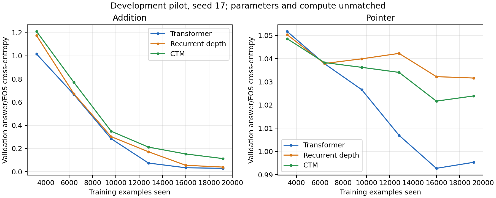

# Algorithmic pilot results

One initialization seed, 600 updates × 32 examples per model/task. Best validation answer/EOS cross-entropy selects the checkpoint. These exploratory presets are not parameter- or compute-matched.

| Task | Model | Selected step | ID exact match | Harder operation | Longer input | Joint OOD | Training seconds |
|---|---|---:|---:|---:|---:|---:|---:|
| addition | Transformer | 600 | 97.1% | 0.4% | 0.0% | 0.0% | 20.7 |
| addition | Recurrent depth | 600 | 95.6% | 9.4% | 0.0% | 0.0% | 50.4 |
| addition | CTM | 600 | 91.9% | 0.0% | 0.0% | 0.0% | 83.7 |
| pointer | Transformer | 500 | 14.1% | 12.1% | 9.0% | 5.5% | 20.9 |
| pointer | Recurrent depth | 600 | 9.4% | 15.6% | 4.7% | 2.3% | 57.5 |
| pointer | CTM | 500 | 7.8% | 12.5% | 8.6% | 7.8% | 100.8 |

“Harder operation” means two carries at fixed two-digit width for addition, and paths of depth 4–6 at fixed eight-node size for pointer chasing. Exact match requires an unconstrained greedy answer followed by EOS.

Training seconds include batching, transfer, forward/backward, and optimizer updates; exclude validation, checkpoint writes, and post-training generation. GPUs ran separate task queues concurrently.

## Pointer ID accuracy by requested path depth

| Model | Depth 1 | Depth 2 | Depth 3 |
|---|---:|---:|---:|
| Transformer | 9.3% | 18.6% | 14.3% |
| Recurrent depth | 11.6% | 7.0% | 9.5% |
| CTM | 7.0% | 7.0% | 9.5% |

## Simple references

- addition: always emit the training majority answer `109` and EOS → ID accuracy 0.7%.
- pointer: always emit the training majority answer `A` and EOS → ID accuracy 10.9%.
- Pointer uniform-node guessing with EOS has expected accuracy 12.5% on eight-node maps and 8.3% on twelve-node maps. Excluding the known-impossible start node raises these references to 14.3% and 9.1%, without reading any edges.

Every per-example prediction, termination flag, and difficulty group is retained in the adjacent `.eval.json` files. `pilot_summary.json` includes counts, losses, provenance, and checkpoint hashes.

Learned positions beyond the training range confound the length-OOD results. One seed and small evaluation sets do not support a superiority claim. See [task protocol](../../ALGORITHMIC_TASKS.md).
