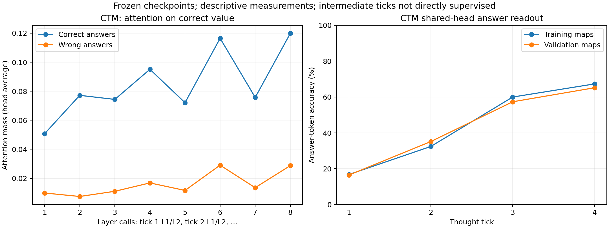

# Attention and CTM temporal audit results

All 9,216 instrumented query forwards preserved full native logits exactly and reproduced the earlier generated answer token. No optimizer update or checkpoint reselection occurred.

## Validation attention by event (averaged over heads)

| Model / event | Correct-value mass, correct answers | Correct-value mass, wrong answers | Query-label mass |
|---|---:|---:|---:|
| Transformer / layers.0.attn/call1 | 0.053 | 0.000 | 0.553 |
| Transformer / layers.1.attn/call1 | 0.019 | 0.019 | 0.064 |
| Recurrent depth / prelude.0.attn/call1 | 0.038 | 0.000 | 0.691 |
| Recurrent depth / core.0.attn/call1 | 0.029 | 0.005 | 0.101 |
| Recurrent depth / core.1.attn/call1 | 0.025 | 0.005 | 0.369 |
| Recurrent depth / core.0.attn/call2 | 0.031 | 0.005 | 0.112 |
| Recurrent depth / core.1.attn/call2 | 0.024 | 0.005 | 0.355 |
| Recurrent depth / core.0.attn/call3 | 0.033 | 0.005 | 0.115 |
| Recurrent depth / core.1.attn/call3 | 0.026 | 0.005 | 0.358 |
| Recurrent depth / core.0.attn/call4 | 0.032 | 0.005 | 0.116 |
| Recurrent depth / core.1.attn/call4 | 0.025 | 0.005 | 0.358 |
| Recurrent depth / coda.0.attn/call1 | 0.013 | 0.002 | 0.129 |
| CTM / layers.0.attn_dropout/call1 | 0.051 | 0.010 | 0.263 |
| CTM / layers.1.attn_dropout/call1 | 0.077 | 0.008 | 0.273 |
| CTM / layers.0.attn_dropout/call2 | 0.074 | 0.011 | 0.363 |
| CTM / layers.1.attn_dropout/call2 | 0.095 | 0.017 | 0.270 |
| CTM / layers.0.attn_dropout/call3 | 0.072 | 0.012 | 0.352 |
| CTM / layers.1.attn_dropout/call3 | 0.116 | 0.029 | 0.192 |
| CTM / layers.0.attn_dropout/call4 | 0.076 | 0.014 | 0.345 |
| CTM / layers.1.attn_dropout/call4 | 0.120 | 0.029 | 0.181 |

Attention to the literal answer value is a narrow diagnostic. Source-label tokens and hidden representations can carry useful information. Correct/wrong differences are associations, not interventions. Per-head measurements and other token-category masses are retained in `summary.json`.

## CTM readout across trained ticks

| Tick | Training-map answer-token accuracy | Validation answer-token accuracy | Validation mean correct-answer probability |
|---|---:|---:|---:|
| 1 | 16.8% | 16.5% | 0.165 |
| 2 | 32.4% | 35.2% | 0.331 |
| 3 | 60.0% | 57.3% | 0.538 |
| 4 | 67.3% | 65.1% | 0.606 |

Intermediate tick scores are answer-token readouts, without EOS evaluation. Only tick 4 was directly supervised; all ticks participate in backpropagation.

## No-update temporal gradient and loss audit

FP32 gradients of final CE to tick output states have norms: 0.046388, 0.040092, 0.038910, 0.049654. This confirms connectivity on the selected 32-example training batch; it does not establish optimal gradient balance.

| Objective | Before fix | Masked oracle | Ratio |
|---|---:|---:|---:|
| final_ce | 0.399338 | 0.399338 | 1.000000 |
| ramp_mono | 0.898494 | 0.898494 | 1.000000 |
| dynamic_aggregate | 0.031152 | 0.841108 | 0.037037 |

The inactive `dynamic_aggregate` path divides by all token positions, including ignored prompts. Here it scales the intended answer/EOS loss by 2/54 = 1/27. Final CE and ramp loss with zero monotonicity weight agree with the masked oracle. This issue does not affect the existing final-CE pilot results. The inactive dynamic-loss path is now corrected: its loss is 0.841108, exactly matching the masked oracle. Five model-level loss/gradient tests pass, including a wholly ignored example and rejection of an entirely unsupervised batch. The final-CE loss and audited tick gradients are unchanged. Before/after source versions and measurements are archived separately.

See [protocol, interpretation, and proposed ablations](../../ATTENTION_TEMPORAL.md) and the immutable [pre-measurement plan](PLAN_BEFORE_RUNS.md). Raw attention arrays and per-query metadata are retained.
