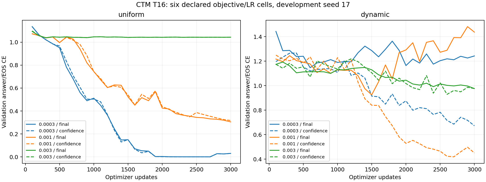

# CTM learning-rate development

Six declared objective/LR cells at seed 17; the two LR 0.001 controls are reused unchanged from the preceding study. Four new trials completed the full 3,000-update budget. Checkpoint and readout selection use only the original validation maps. No test forwards belong to this development stage.

Selected recipe: **uniform, peak LR 0.0003, confidence readout**, update 2700, validation CE 0.000313751 and exact answer+EOS accuracy 100.00%.

| Objective | Peak LR | Readout | Update | Validation CE | Validation accuracy | Training min | Run min | Reused |
|---|---:|---|---:|---:|---:|---:|---:|---|
| uniform | 0.0003 | confidence | 2700 | 0.000313751 | 100.00% | 32.7 | 34.5 | no |
| uniform | 0.001 | final | 3000 | 0.305035 | 76.56% | 33.4 | 35.2 | yes |
| uniform | 0.003 | final | 300 | 1.039 | 13.28% | 33.5 | 35.2 | no |
| dynamic | 0.0003 | confidence | 3000 | 0.67206 | 56.25% | 32.6 | 34.3 | no |
| dynamic | 0.001 | confidence | 2700 | 0.418433 | 73.44% | 33.0 | 34.7 | yes |
| dynamic | 0.003 | confidence | 2600 | 0.928649 | 28.91% | 32.9 | 34.6 | no |

New training cost: 131.7 GPU minutes; total run cost including validation/checkpoints: 138.5 GPU minutes. These sums are not elapsed wall time because two GPUs ran concurrently.

T16/H8, width 128, two CTM layers, 544,839 parameters, batch 32, BF16 autocast with FP32 parameters/moments. Each trial sees 96,000 examples, 5,184,000 input tokens and 192,000 supervised answer/EOS labels. The monotonic penalty is zero. The architecture and temporal objectives are unchanged.

The next stage freezes this objective/LR/readout, retains the earlier baseline recipes, and trains all three families at seeds 23, 29 and 31 before fresh-map evaluation. Selection at one development seed can be seed-sensitive; the new-seed results are the primary confirmation. Tuning effort and compute remain unequal across families.

See [frozen plan](PLAN_BEFORE_RUNS.md), `registry.json`, `selection.json`, and `pre_run_source.json` for exact choices and hashes.
