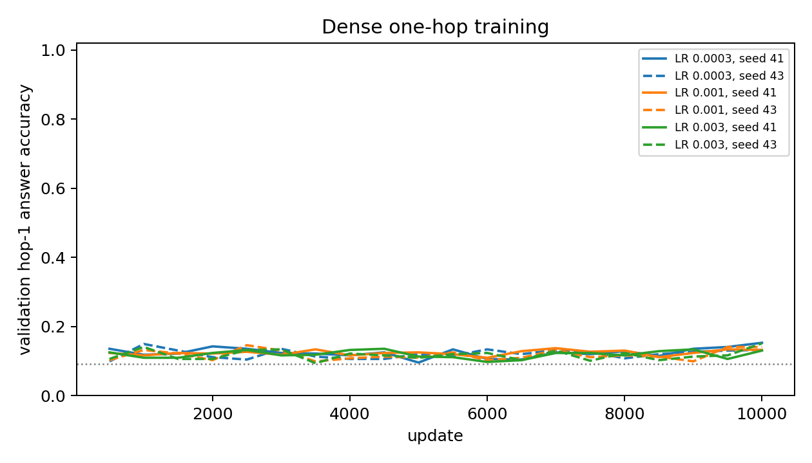
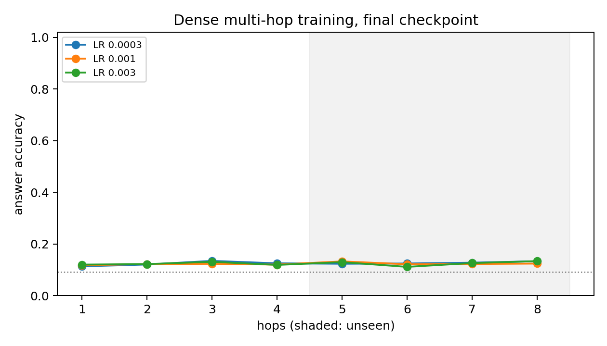

# Dense Transformer calibration (Stage D1a)

All 12 declared Transformer runs completed and were evaluated from checkpoints frozen at exactly 10,000 updates. Every training map was presented once, with 6 supervised answers per map. Per-answer chance is 9.09%; a guesser exploiting permutation exclusion reaches at most 12.28%. Development splits only; no test set exists for this study.

## One-hop learnability by learning rate

Teacher-forced hop-1 answer accuracy on 256 held-out `eval_id` maps (1,536 answers), final checkpoint.

| Peak LR | seed 41 | seed 43 | Mean | All 6 correct (mean) | First validation update ≥ 90% | Final train CE |
|---:|---:|---:|---:|---:|---:|---:|
| 0.0003 | 13.02% | 12.43% | 12.73% | 0.00% | never, never | 1.8470 |
| 0.001 | 12.37% | 11.72% | 12.04% | 0.00% | never, never | 1.8480 |
| 0.003 | 12.30% | 12.70% | 12.50% | 0.00% | never, never | 1.8472 |

**D1 selected LR: 0.0003.** **D2: dense format NOT learnable** (mean 12.73%, lowest seed 12.43%; gate ≥ 90% mean, ≥ 80% each).

## Multi-hop training (hops 1–4), answer accuracy by hop

Hops 5–8 are unseen depths. Mean of both seeds (per-seed values in `summary.json`).

| Peak LR | hop 1 | hop 2 | hop 3 | hop 4 | hop 5 | hop 6 | hop 7 | hop 8 |
|---:|---:|---:|---:|---:|---:|---:|---:|---:|
| 0.0003 | 11.33% | 12.04% | 13.44% | 12.50% | 12.34% | 12.43% | 12.76% | 13.31% |
| 0.001 | 11.78% | 12.21% | 12.30% | 12.01% | 13.25% | 12.14% | 12.24% | 12.40% |
| 0.003 | 12.01% | 12.21% | 13.09% | 11.88% | 12.96% | 11.13% | 12.60% | 13.35% |

## One-hop accuracy by answer position

Exclusion can help later positions; a pure exclusion guesser rises from 9.09% at position 1 to 16.67% at position 6.

| Peak LR | pos 1 | pos 2 | pos 3 | pos 4 | pos 5 | pos 6 |
|---:|---:|---:|---:|---:|---:|---:|
| 0.0003 | 9.03% | 10.25% | 10.69% | 13.67% | 14.01% | 18.70% |
| 0.001 | 9.38% | 9.77% | 10.99% | 12.60% | 13.72% | 18.80% |
| 0.003 | 9.08% | 10.55% | 11.57% | 12.84% | 13.82% | 16.55% |

## Training

| Cell | Final train CE (last 100) | Train min | Peak GiB |
|---|---:|---:|---:|
| transformer_onehop_lr3e-4_seed41 | 1.8478 | 6.7 | 0.072 |
| transformer_onehop_lr1e-3_seed41 | 1.8479 | 6.8 | 0.072 |
| transformer_onehop_lr3e-3_seed41 | 1.8475 | 6.8 | 0.072 |
| transformer_multihop_lr3e-4_seed41 | 1.8486 | 6.9 | 0.072 |
| transformer_multihop_lr1e-3_seed41 | 1.8481 | 6.9 | 0.072 |
| transformer_multihop_lr3e-3_seed41 | 1.8481 | 6.9 | 0.072 |
| transformer_onehop_lr3e-4_seed43 | 1.8463 | 6.8 | 0.072 |
| transformer_onehop_lr1e-3_seed43 | 1.8482 | 6.7 | 0.072 |
| transformer_onehop_lr3e-3_seed43 | 1.8469 | 6.8 | 0.072 |
| transformer_multihop_lr3e-4_seed43 | 1.8479 | 6.8 | 0.072 |
| transformer_multihop_lr1e-3_seed43 | 1.8479 | 6.9 | 0.072 |
| transformer_multihop_lr3e-3_seed43 | 1.8462 | 6.8 | 0.072 |

See [frozen protocol](PLAN_BEFORE_RUNS.md), `registry.json`, `checkpoints.json` and the per-cell evaluation files.
