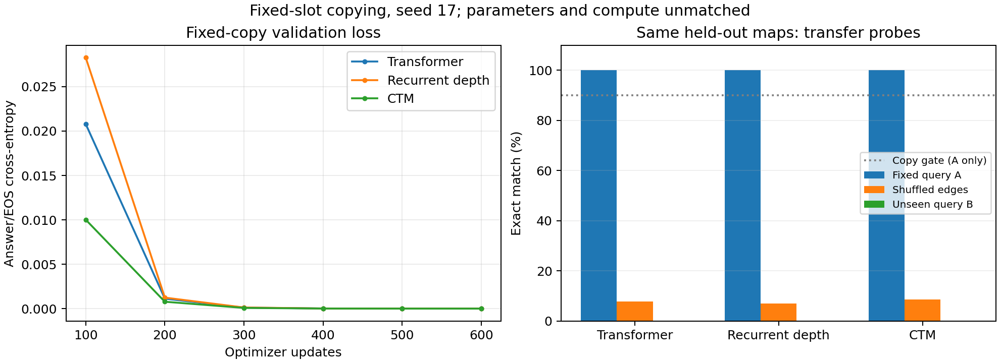

# Fixed-slot value-copy results

Same maps, splits, row order, prompt lengths, seed 17, and 600-update presets as the ordered-edge pilot. Training, validation, and primary evaluation now always query A; labels are its successors. Best validation answer/EOS CE selects each checkpoint.

| Model | Train | Held-out copy A | Same maps shuffled | Same maps query B | Copy ≥90% | Selected step | Training seconds |
|---|---:|---:|---:|---:|---|---:|---:|
| Transformer | 100.0% | 100.0% | 7.8% | 0.0% | Pass | 600 | 14.5 |
| Recurrent depth | 100.0% | 100.0% | 7.0% | 0.0% | Pass | 600 | 54.8 |
| CTM | 100.0% | 100.0% | 8.6% | 0.0% | Pass | 600 | 89.7 |

All held-out columns reuse the same 128 unseen maps. Query B is absent from training/validation and always changes the correct answer. Its score measures out-of-distribution transfer. All exact matches require unrestricted greedy answer generation followed by EOS.

## Query intervention on held-out maps

| Model | Correct B answer | Outputs original A answer with EOS | Identical prediction before/after |
|---|---:|---:|---:|
| Transformer | 0/128 | 128/128 | 128/128 |
| Recurrent depth | 0/128 | 128/128 | 128/128 |
| CTM | 0/128 | 128/128 | 128/128 |

## Earlier variable-query training control

| Model | Earlier ordered variable-query held-out | Current fixed-query held-out |
|---|---:|---:|
| Transformer | 24.2% | 100.0% |
| Recurrent depth | 38.3% | 100.0% |
| CTM | 21.9% | 100.0% |

These columns use separately trained models with different query/label distributions. They are not paired correctness comparisons. Every run sees 19,200 examples, 1,036,800 real input tokens, and 38,400 supervised tokens. Parameters and compute remain unmatched. Training time excludes validation, checkpoint, and evaluation work.

See the [protocol and interpretation](../../FIXED_POINTER.md), [pre-run plan](PLAN_BEFORE_RUNS.md), raw learning curves under the run directories, and per-example `.eval.json` files. This exploratory control does not establish arbitrary lookup, multi-step reasoning, or an architecture ranking.
