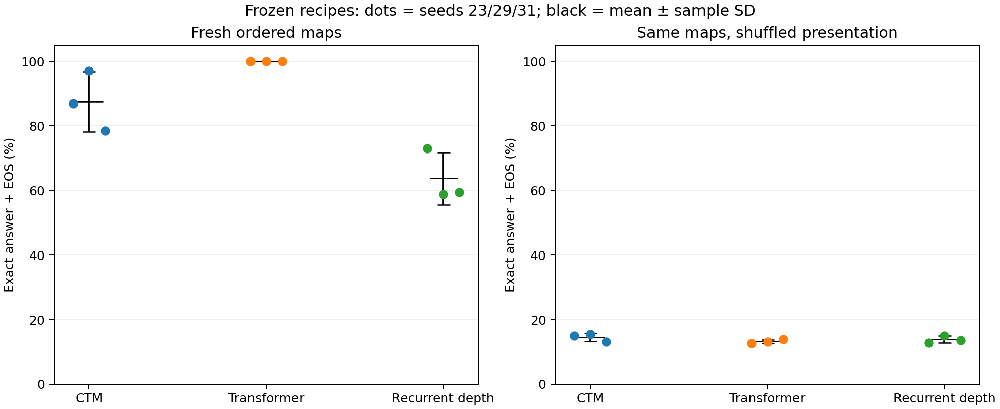

# Fresh-map confirmation across independent training seeds

Recipes were frozen before new training. All nine new runs completed 3,000 updates, and all selected checkpoints were locked before any fresh-test forward. Evaluation uses 512 previously unused semantic maps, with paired ordered and shuffled presentations. Training uses the existing ordered maps.

## Primary result: seeds 23, 29, 31

| Family | Ordered accuracy, mean ± SD | Shuffled accuracy, mean ± SD | Ordered CE, mean ± SD | Shuffled CE, mean ± SD |
|---|---:|---:|---:|---:|
| ctm | 87.50% ± 9.29 | 14.52% ± 1.26 | 0.21466 ± 0.123 | 2.9604 ± 0.6 |
| transformer | 100.00% ± 0.00 | 13.22% ± 0.60 | 4.4354e-08 ± 7.36e-08 | 7.3521 ± 0.318 |
| recurrent_depth | 63.74% ± 8.07 | 13.87% ± 1.09 | 0.49179 ± 0.113 | 2.3494 ± 0.233 |

Accuracy requires unrestricted greedy generation of the correct answer and EOS. CE is teacher-forced and token-weighted over answer/EOS. SD is sample standard deviation across three training seeds, not a confidence interval. All seeds share the same 512 maps; 1,536 predictions per family do not constitute 1,536 independent test maps.

## Locked recipes

| Family | Development recipe | Peak LR | Fixed readout | Parameters |
|---|---|---:|---|---:|
| ctm | ctm_uniform_lr_low | 0.0003 | confidence | 544,839 |
| transformer | transformer_lr_low | 0.0003 | final | 548,660 |
| recurrent_depth | recurrent_depth_lr_mid | 0.001 | confidence | 525,984 |

The CTM objective/LR/readout was selected on the six-cell seed-17 development grid. Baseline recipes were carried forward from the earlier comparison. Only the checkpoint update is selected separately for each confirmation seed, using original validation CE under the fixed family readout.

## Per-seed results

| Family | Seed | Selected update | Validation CE | Validation accuracy | Ordered accuracy | Shuffled accuracy | Training min | Run min | Peak GiB |
|---|---:|---:|---:|---:|---:|---:|---:|---:|---:|
| ctm | 23 | 2900 | 0.347063 | 81.25% | 86.91% | 15.04% | 31.4 | 32.5 | 2.304 |
| ctm | 29 | 2000 | 0.0398256 | 98.44% | 97.07% | 15.43% | 32.4 | 33.5 | 2.304 |
| ctm | 31 | 2200 | 0.318487 | 76.56% | 78.52% | 13.09% | 31.9 | 32.9 | 2.312 |
| transformer | 23 | 2300 | 1.86265e-09 | 100.00% | 100.00% | 12.70% | 1.9 | 2.1 | 0.059 |
| transformer | 29 | 3000 | 2.79397e-09 | 100.00% | 100.00% | 13.09% | 1.8 | 2.0 | 0.059 |
| transformer | 31 | 3000 | 1.39233e-07 | 100.00% | 100.00% | 13.87% | 1.9 | 2.0 | 0.059 |
| recurrent_depth | 23 | 2000 | 0.369748 | 71.88% | 73.05% | 12.89% | 15.6 | 16.3 | 0.418 |
| recurrent_depth | 29 | 2500 | 0.526357 | 64.84% | 58.79% | 15.04% | 15.4 | 16.2 | 0.418 |
| recurrent_depth | 31 | 2500 | 0.542712 | 64.06% | 59.38% | 13.67% | 16.3 | 17.1 | 0.418 |

## Development seed 17: separate reference

Seed 17 informed recipe selection and is excluded from the primary means and SDs.

| Family | Ordered accuracy | Shuffled accuracy | Ordered CE | Shuffled CE |
|---|---:|---:|---:|---:|
| ctm | 99.22% | 13.87% | 0.0133208 | 4.08092 |
| transformer | 100.00% | 12.89% | 4.88944e-09 | 7.69865 |
| recurrent_depth | 100.00% | 12.30% | 3.06172e-08 | 7.74556 |

## Paired seed differences

| CTM minus baseline | Mean accuracy difference (points) | Sample SD (points) |
|---|---:|---:|
| ctm_minus_transformer_test_id | -12.50 | 9.29 |
| ctm_minus_transformer_test_shuffled | +1.30 | 1.80 |
| ctm_minus_recurrent_depth_test_id | +23.76 | 12.85 |
| ctm_minus_recurrent_depth_test_shuffled | +0.65 | 1.39 |

Each difference pairs the same training seed and the same evaluation maps. Three seeds are too few for a precise account of optimization variability. No significance claim or unpaired binomial interval is implied.

## Exposure and cost

Each run uses 96,000 example presentations, 5,184,000 input tokens, and 192,000 supervised answer/EOS labels. Parameters are approximately matched, within 3.5%. Training time covers all 3,000 updates, even when an earlier checkpoint is selected. Run time includes validation and checkpoint writing.

| Family | Confirmation runs | Training GPU min | Total run GPU min |
|---|---:|---:|---:|
| ctm | 3 | 95.7 | 98.9 |
| transformer | 3 | 5.7 | 6.0 |
| recurrent_depth | 3 | 47.3 | 49.6 |

These are summed device times, not concurrent elapsed time or FLOPs. They exclude development tuning, setup and final evaluation. No new inference latency benchmark was run. The previous latency comparison applies to its particular checkpoints/readouts.

## Scope and remaining controls

- The held-out maps exclude all 2,560 semantic maps in the frozen prior data inventory. Ordered and shuffled presentations share the same maps, starts and answers.
- This is one-hop lookup on eight-node cycles under ordered training. Shuffled test presentation measures transfer; it is not evidence about performance after shuffled training or multistep composition.
- Auxiliary objectives, compute and historical tuning effort differ. These are complete-recipe comparisons; architecture attribution still requires matched temporal supervision and compute budgets.
- Dynamic aggregation and label-free confidence readout are distinct choices. Gold-aware prefix minima are diagnostic envelopes, not deployment policies. No historical CTM reproduction claim follows from these results.
- Fresh-seed variability and task restrictions must be retained in any paper claim. Further tuning must belong to a new development study with a new final evaluation plan.

See [CTM LR development](../ctm_lr_v1/RESULTS.md), [frozen protocol](../../CTM_LR_CONFIRMATION.md), `recipes.json`, `checkpoints.json`, source archives, and per-example `*.evaluation.json` files.
