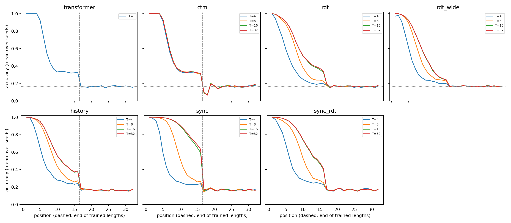

# S3 word problem: serial state across architectures

35 runs (7 cells × 5 seeds [47, 53, 59, 61, 67]), 10,000 updates, peak LR 0.0003. Training uses fresh words of lengths 1–16. Evaluation uses 1,024 held-out words of length 32 per seed, labeled at every position. Positions 1–16 are trained lengths; 17–32 are extrapolation. Chance 1/6. **Correct prefix** = number of leading positions with accuracy ≥ 90%. Development data; no test set.

## Primary: correct prefix at the trained step budget (Transformer T=1, others T=16)

| Cell | Parameters | Per seed | Median | Mean accuracy, positions 9–16 | Mean accuracy, positions 17–32 | Train min |
|---|---:|---|---:|---:|---:|---:|
| transformer | 548,660 | 5, 5, 5, 4, 5 | 5 | 33.3% | 16.4% | 5 |
| ctm | 544,839 | 5, 5, 5, 4, 5 | 5 | 33.7% | 15.8% | 102 |
| rdt | 525,984 | 4, 3, 5, 8, 8 | 5 | 43.3% | 16.7% | 52 |
| rdt_wide | 565,900 | 4, 6, 4, 5, 8 | 5 | 36.4% | 16.8% | 57 |
| history | 541,536 | 4, 5, 7, 5, 14 | 5 | 46.7% | 16.5% | 62 |
| sync | 550,688 | 12, 10, 7, 16, 10 | 10 | 77.6% | 16.6% | 61 |
| sync_rdt | 566,240 | 8, 5, 12, 6, 12 | 8 | 59.5% | 16.8% | 70 |

## Correct prefix by inference step budget (median across seeds)

| Cell | T=4 | T=8 | T=16 | T=32 |
|---|---:|---:|---:|---:|
| ctm | 5 | 5 | 5 | 5 |
| rdt | 2 | 5 | 5 | 5 |
| rdt_wide | 3 | 4 | 5 | 5 |
| history | 3 | 5 | 5 | 5 |
| sync | 3 | 7 | 10 | 11 |
| sync_rdt | 3 | 6 | 8 | 8 |

## Declared decisions

| Comparison (correct prefix) | Larger seeds (first/second) | Median difference | Exceeds |
|---|---:|---:|---|
| rdt vs transformer | 2/2 | +0 | neither |
| rdt vs ctm | 2/2 | +0 | neither |
| ctm vs transformer | 0/0 | +0 | neither |
| sync vs rdt | 5/0 | +7 | first |
| sync vs rdt_wide | 5/0 | +4 | first |
| history vs rdt | 3/1 | +2 | neither |
| history vs rdt_wide | 2/1 | +0 | neither |
| sync_rdt vs rdt | 4/1 | +4 | first |
| sync_rdt vs rdt_wide | 4/1 | +4 | first |
| rdt_wide vs rdt | 1/2 | +0 | neither |
| ctm: T=16 vs T=4 | 1/0 | +0 | no |
| rdt: T=16 vs T=4 | 5/0 | +3 | yes |
| rdt_wide: T=16 vs T=4 | 5/0 | +3 | yes |
| history: T=16 vs T=4 | 5/0 | +3 | yes |
| sync: T=16 vs T=4 | 5/0 | +7 | yes |
| sync_rdt: T=16 vs T=4 | 5/0 | +5 | yes |

- **recurrence beats fixed depth:** no
- **rdt beats ctm:** no
- **sync extends state:** yes
- **history extends state:** no
- **sync rdt extends state:** yes
- **ctm uses steps:** no
- **rdt uses steps:** yes
- **rdt wide uses steps:** yes
- **history uses steps:** yes
- **sync uses steps:** yes
- **sync rdt uses steps:** yes

See [frozen protocol](PLAN_BEFORE_RUNS.md), `registry.json`, `checkpoints.json` and the per-run evaluation files.
