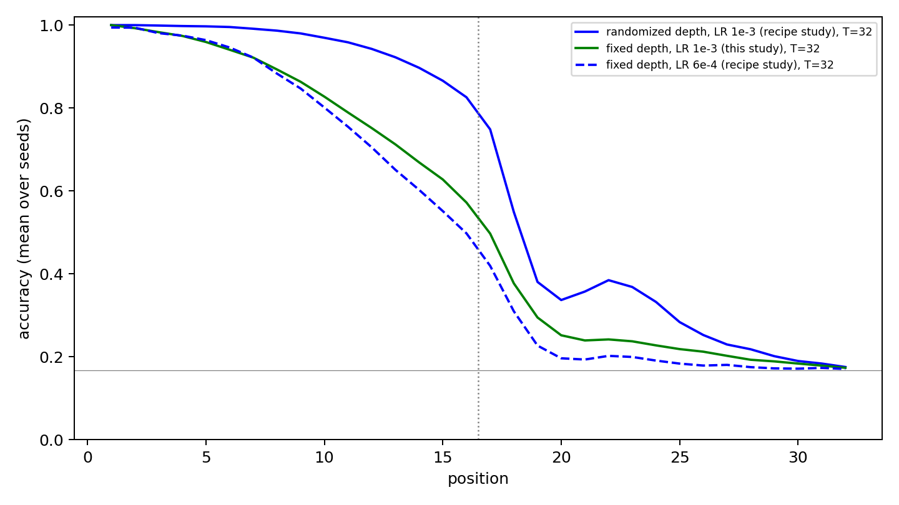

# S3 learning-rate control: fixed depth at the randomized-depth learning rate

Fixed-depth RoPE RDT trained at LR 1e-3 on the recipe confirmation's 30 seeds and data, paired with that study's randomized-depth (LR 1e-3) and fixed-depth (LR 6e-4) cells. Escape: mean accuracy over positions 9–16 ≥ 90% at T=16.

| Cell | Escaped | 95% CI | Positions 1–16 (T=16) | Positions 17–24 (T=32) | Median prefix T=4/8/16/32/48/64 |
|---|---:|---|---:|---:|---|
| randomized depth, LR 1e-3 (recipe study) | 24/30 | 61.4%–92.3% | 95.8% | 43.2% | 10/15/15/15/15/15 |
| fixed depth, LR 1e-3 (this study) | 1/30 | 0.1%–17.2% | 84.1% | 29.6% | 3/7/8/8/8/8 |
| fixed depth, LR 6e-4 (recipe study) | 0/30 | 0.0%–11.6% | 81.5% | 24.2% | 3/7/8/8/8/8 |

## Declared paired tests (Holm over both)

| Test | Comparison | Metric | Effect | p | p (Holm) |
|---|---|---|---|---:|---:|
| C1 | rdt_rope_rand vs rdt_rope_fixed_lr1e3 | mean accuracy positions 1-16 at T=16 (paired sign-flip) | mean diff +11.7 points | 5.00e-07 | 5.00e-07 |
| C2 | rdt_rope_rand vs rdt_rope_fixed_lr1e3 | escape at T=16 (paired exact McNemar) | 23 vs 0 discordant | 2.38e-07 | 4.77e-07 |

## Secondary (not corrected)

| Comparison | Metric | Effect | p |
|---|---|---|---:|
| rdt_rope_fixed_lr1e3 vs rdt_rope_fixed | mean accuracy positions 1-16 at T=16 (paired sign-flip; not corrected) | mean diff +2.6 points | 2.41e-01 |
| rdt_rope_fixed_lr1e3 vs rdt_rope_fixed | escape at T=16 (paired exact McNemar; not corrected) | 1 vs 0 discordant | 1.00e+00 |
| rdt_rope_rand vs rdt_rope_fixed_lr1e3 | mean accuracy positions 17-24 at T=32 (paired sign-flip; not corrected) | mean diff +13.6 points | 6.42e-03 |

Sign-flip p-values use 2,000,000 seeded Monte Carlo sign assignments with the +1 correction (floor 5.0e-07); McNemar is exact.

See [frozen protocol](PLAN_BEFORE_RUNS.md), `registry.json`, `checkpoints.json` and the per-run evaluation files.
