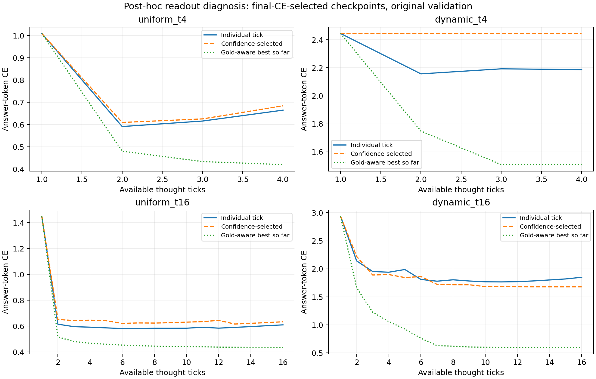

# Best-across-ticks clarification and readout diagnosis

## Why the original comparison is incomplete

On 2026-09-23 the user clarified that the successful earlier dynamic recipe chose the best prediction across ticks and exhibited decreasing CE and increasing accuracy. The exact historical selection mechanism and recipe remain to be identified. The frozen pilot selected checkpoints by **last-tick validation CE**. A subsequent confidence readout on those checkpoints does not optimize or reproduce a best-across-ticks recipe. The [original results](RESULTS.md) remain a record of that explicit protocol, not a rejection of the earlier finding.

## Implementation audit

- Current dynamic training averages each supervised token's minimum-tick CE and highest-native-certainty-tick CE. It already supplies gradient through a best-loss tick; it is not final-only training.
- The model's default `logits` output is still the final tick. Our added confidence wrapper selects per generated token across all ticks.
- The separate adjacent-tick monotonicity penalty was disabled in every pilot cell. Best-tick selection alone does not require each individual tick's CE to improve.
- Local commit `a403207` used soft weighting of batch-mean tick losses, a soft weighting based on mean certainty, and an auxiliary mean-loss component. Commit `54d40f4` used hard per-token minimum-loss/maximum-certainty selections; `d841c16` retained that structure after consolidation. These are materially different objectives. The inspected versions returned final-tick default logits.
- Exact commit/file hashes and excerpts are saved in [historical_loss_audit.json](historical_loss_audit.json). None has been identified as the user's winning configuration.

## Fixed final checkpoints with confidence readout

Post-hoc follow-up: use update 3,000 for **every** cell, without searching for the best confidence checkpoint. The selection policy is unchanged minimum FP32 entropy per next token, with full unrolling and unrestricted generation. Scores require the answer plus EOS. No test data were used.

| Trained depth | Uniform | Dynamic | Dynamic − uniform |
|---|---:|---:|---:|
| T4 | 80.5% | 54.7% | −25.8 percentage points |
| T16 | 76.6% | 70.3% | −6.3 percentage points |

Dynamic improves by 15.6 points from T4 to T16 under this fixed-final-update policy. The corresponding descriptive interaction is +19.5 points. These single-seed, validation-only results show a policy/depth dependence; they do not yet reproduce dynamic superiority or equivalence at T4.

For dynamic T4, last-tick CE selected update 300, whose confidence-readout accuracy was 14.1%, versus 54.7% at update 3,000. For dynamic T16 it selected update 1,500, giving 44.5% versus 70.3% at update 3,000. Uniform selected update 3,000 at both depths. Thus the original checkpoint-selection criterion substantially understated final-checkpoint dynamic performance under confidence readout. This observation does not identify an optimal confidence-selected checkpoint; intermediate checkpoints were not all retained.

Reproduction: `python -m scripts.eval_final_confidence` with the documented CUDA environment and fresh output paths. Full predictions/checkpoint digests: `*.final.confidence.json`; summary: `final_confidence_comparison.json`.

## Individual ticks versus best-so-far envelopes

The diagnostic below uses the **original final-CE-selected checkpoints**, so its values must not be combined with the final-checkpoint table above. These are answer-token metrics on the original prompt; they do not require EOS. Teacher-forced answer/EOS metrics are also saved separately.

| Cell | Last-tick answer accuracy | Confidence-selected answer accuracy | Gold-aware minimum-CE-tick accuracy | Correct answer at any tick |
|---|---:|---:|---:|---:|
| uniform_t4 | 77.3% | 80.5% | 86.7% | 86.7% |
| dynamic_t4 | 14.1% | 14.1% | 41.4% | 41.4% |
| uniform_t16 | 76.6% | 76.6% | 83.6% | 84.4% |
| dynamic_t16 | 21.9% | 44.5% | 89.8% | 92.2% |

Dynamic T16 supplies a correct answer at some tick more often than uniform T16 in this diagnostic. Its confidence selector fails to recover many of those candidates. This motivates studying the selector and its training, rather than interpreting final-tick accuracy alone as the capacity of the trajectory.

Gold-aware minimum CE over an expanding prefix cannot increase, by definition. Similarly, the fraction with any correct tick cannot decrease. Both require labels to identify success and are diagnostic envelopes, not deployable generation scores. Accuracy at the minimum-CE tick is a different quantity and need not be monotonic in a multiclass problem. Confidence selection is deployable but does not automatically guarantee monotonic CE or accuracy. Apply all definitions symmetrically to uniform and dynamic.

Reproduction: `python -m scripts.diagnose_tick_selection`; two focused tests verify tie behavior, label-independent confidence selection, and the distinction between minimum CE and monotonic accuracy. Full per-token losses, entropy, correctness, checkpoint identities, and source hashes are in `tick_selection_diagnostic.json`.

## Next work

1. Identify the exact historical objective and selector: soft versus hard weighting, per-token versus shared tick selection, auxiliary loss, confidence measure, monotonic penalty/schedule, T/H, and any distillation. The user's clarification establishes best-across-ticks as essential; it does not yet specify how a tick was selected without labels.
2. Make readout policy and checkpoint selection explicit in the research runner. For a confidence deployment policy, validate its token CE and generated accuracy throughout training and select checkpoints using a prespecified policy-matched criterion. Log raw, confidence-selected, and gold-aware diagnostic curves separately; preserve candidate checkpoints and tick-selection histograms.
3. Verify the recovered objective/selector before another training sweep. Keep the existing fixed recipe as a named control, then repeat the T4/T16 comparison and seed replication with equal tuning opportunities for the later architecture comparison.
