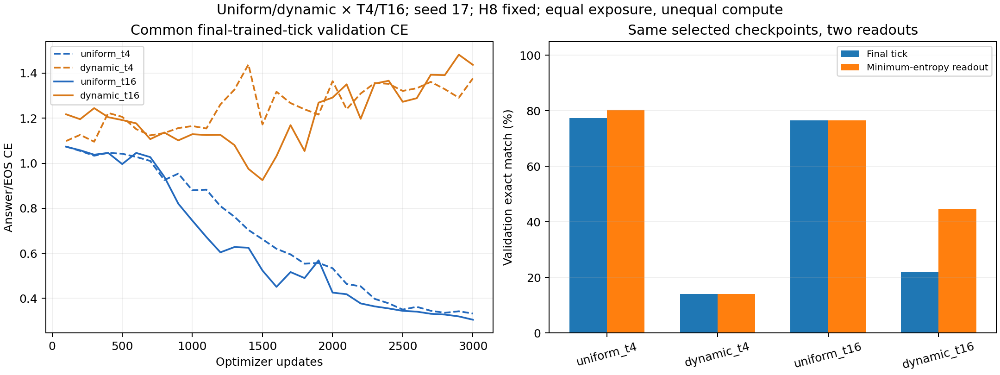

# Uniform versus dynamic aggregation across depth

The subsequent user clarification and policy-matched final-checkpoint follow-up are documented in [READOUT_FOLLOWUP.md](READOUT_FOLLOWUP.md). Read these together: final-tick CE selected substantially worse dynamic checkpoints for confidence inference.

One seed, fixed H=8, 3,000 updates and equal example/token exposure per cell. Uniform T4 is reused from the archived temporal ablation; three other cells start fresh. Core model code is identical. The shared runner additionally admits corrected dynamic loss. No held-out test split was evaluated.

| Cell | Best final validation CE | Final-tick validation accuracy | Confidence readout accuracy | All-start accuracy | Maps: all 8 correct | Selected step | Train min | Peak GiB |
|---|---:|---:|---:|---:|---:|---:|---:|---:|
| uniform_t4 | 0.332454 | 77.3% | 80.5% | 77.7% | 12/128 | 3000 | 8.5 | 0.653 |
| dynamic_t4 | 1.095522 | 14.1% | 14.1% | 12.5% | 0/128 | 300 | 8.6 | 0.655 |
| uniform_t16 | 0.305035 | 76.6% | 76.6% | 78.9% | 12/128 | 3000 | 35.4 | 2.304 |
| dynamic_t16 | 0.924771 | 21.9% | 44.5% | 23.0% | 0/128 | 1500 | 36.3 | 2.304 |

Final-tick CE selects every checkpoint. Confidence readout chooses the minimum-FP32-entropy tick independently for each generated token using no labels, runs all trained ticks, and is not early stopping. Both accuracies require answer plus EOS. Confidence readout is secondary; checkpoints were not optimized for it.

## Objective-by-depth contrasts

| Contrast | T4: dynamic − uniform | T16: dynamic − uniform | Interaction: T16 contrast − T4 contrast |
|---|---:|---:|---:|
| Final validation CE | +0.7631 | +0.6197 | -0.1433 |
| Final accuracy (percentage points) | -63.2812 | -54.6875 | +8.5938 |
| Confidence accuracy (percentage points) | -66.4062 | -32.0312 | +34.3750 |
| All-start accuracy (percentage points) | -65.2344 | -55.8594 | +9.3750 |

Lower CE is better; higher accuracy is better. These differences are descriptive, without a seed-variance estimate or significance test. Repeated queries share maps, and validation influenced checkpoint selection.

## Fixed-checkpoint validation depth readouts

| Cell | T1 | T2 | T4 | T8 | T16 |
|---|---:|---:|---:|---:|---:|
| uniform_t4 | 62.5% | 81.2% | 77.3% | — | — |
| dynamic_t4 | 14.1% | 13.3% | 14.1% | — | — |
| uniform_t16 | 39.8% | 75.8% | 76.6% | 77.3% | 76.6% |
| dynamic_t16 | 19.5% | 18.8% | 24.2% | 28.1% | 21.9% |

Depth readouts do not reselect checkpoints or inference policies. T16 has four times the nominal layer applications of T4 and fills/evicts H=8 history; it is not an equal-compute intervention. Each run consumes 96,000 examples, 5,184,000 real input tokens, and 192,000 supervised labels. Reported training time excludes validation/evaluation/checkpoint work.

See [protocol and interpretation](../../OBJECTIVE_DEPTH.md), [pre-run plan](PLAN_BEFORE_RUNS.md), profiles, per-example predictions, and `summary.json` audits. This study addresses the reported depth sensitivity on this task; it is not an architecture comparison or a complete replication of an unspecified historical recipe.
