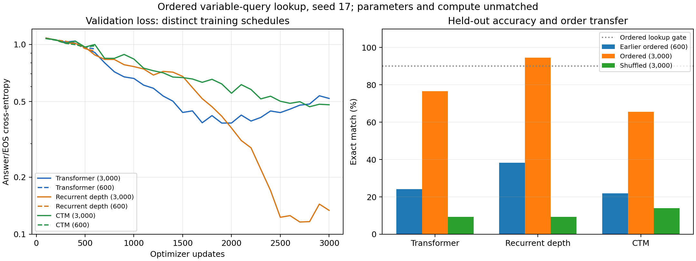

# Longer-budget ordered lookup results

Fresh seed-17 runs on the unchanged ordered variable-query dataset. Each run uses 3,000 updates and an extended cosine decay horizon, with 30 warmup updates. Validation answer/EOS CE selects checkpoints. Parameters and compute remain unmatched.

| Model | Train | Held-out ordered | Same maps shuffled | New query on training maps | Lookup ≥90% | Selected step | Training seconds |
|---|---:|---:|---:|---:|---|---:|---:|
| Transformer | 86.9% | 76.6% | 9.4% | 74.6% | Fail | 1900 | 97.8 |
| Recurrent depth | 96.6% | 94.5% | 9.4% | 94.5% | Pass | 2700 | 286.9 |
| CTM | 82.4% | 65.6% | 14.1% | 63.3% | Fail | 2800 | 466.4 |

Held-out ordered and shuffled evaluations use the same 128 unseen maps and queries. Changed-query probes reuse 256 training maps. All exact matches require unrestricted greedy answers followed by EOS.

## Earlier 600-update comparison

| Model | Earlier held-out ordered | Current held-out ordered | Best validation CE | Final validation CE |
|---|---:|---:|---:|---:|
| Transformer | 24.2% | 76.6% | 0.385116 | 0.519345 |
| Recurrent depth | 38.3% | 94.5% | 0.11601 | 0.133609 |
| CTM | 21.9% | 65.6% | 0.469648 | 0.480883 |

These are separately initialized runs with the same seed and data. Changing the decay horizon changes learning rates before update 600; the experiment does not isolate the effect of additional updates. The 3,000-update runs see 96,000 examples, 5,184,000 real input tokens, and 192,000 supervised tokens each, exactly five times the previous exposure. Recorded training source hashes, tokenizer, model parameter counts, dataset hashes, and all learning rates were checked.

## Paired held-out order intervention

| Model | Both correct | Ordered only | Shuffled only | Neither |
|---|---:|---:|---:|---:|
| Transformer | 8 | 90 | 4 | 26 |
| Recurrent depth | 11 | 110 | 1 | 6 |
| CTM | 11 | 73 | 7 | 37 |

## Changed query on familiar maps

| Model | Correct new answer | Outputs original answer with EOS |
|---|---:|---:|
| Transformer | 191/256 | 15/256 |
| Recurrent depth | 242/256 | 5/256 |
| CTM | 162/256 | 14/256 |

## Held-out accuracy by query start

| Start | Transformer | Recurrent depth | CTM |
|---|---:|---:|---:|
| A | 21/21 | 21/21 | 15/21 |
| B | 11/22 | 19/22 | 10/22 |
| C | 18/18 | 18/18 | 13/18 |
| D | 6/15 | 15/15 | 13/15 |
| E | 8/8 | 8/8 | 8/8 |
| F | 17/17 | 17/17 | 6/17 |
| G | 16/16 | 12/16 | 13/16 |
| H | 1/11 | 11/11 | 6/11 |

Small per-start counts are descriptive; they do not establish subgroup differences. Full train/validation/held-out breakdowns are in `long_summary.json`.

The curves show validation loss at 100-update intervals. Dashed lines denote historical 600-update schedules; solid lines denote the new 3,000-update schedules. Timings exclude validation/checkpoint/evaluation work and are implementation-specific.

See [protocol and interpretation](../../ORDERED_LONG.md), [pre-run plan](PLAN_BEFORE_RUNS.md), and per-example `.eval.json` records. These development results do not establish a model ranking or multi-step reasoning.
