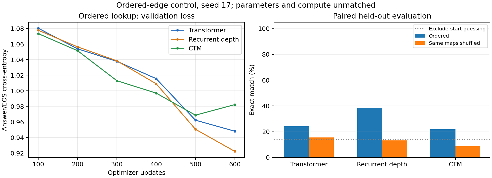

# Ordered-edge lookup results

Same one-hop maps, queries, answers, example order, seed 17, and 600-update presets as the earlier shuffled-edge control. Only edge presentation was sorted for training/validation/primary evaluation. Best validation answer/EOS CE selects the checkpoint.

| Model | Train | Held-out ordered | Same held-out maps shuffled | New start on training maps | Lookup ≥90% | Selected step | Training seconds |
|---|---:|---:|---:|---:|---|---:|---:|
| Transformer | 28.1% | 24.2% | 15.6% | 23.8% | Fail | 600 | 15.5 |
| Recurrent depth | 30.5% | 38.3% | 13.3% | 27.0% | Fail | 600 | 50.8 |
| CTM | 28.4% | 21.9% | 8.6% | 23.0% | Fail | 500 | 95.8 |

The changed-start probe deliberately reuses training maps. The two held-out columns use exactly the same 128 unseen maps and queries. All accuracies require unrestricted greedy answer generation followed by EOS.

## Paired held-out outcomes

| Model | Both correct | Ordered only | Shuffled only | Neither |
|---|---:|---:|---:|---:|
| Transformer | 11 | 20 | 9 | 88 |
| Recurrent depth | 14 | 35 | 3 | 76 |
| CTM | 3 | 25 | 8 | 92 |

## Earlier shuffled-edge training control

| Model | Prior held-out accuracy | Current ordered held-out accuracy |
|---|---:|---:|
| Transformer | 14.1% | 24.2% |
| Recurrent depth | 8.6% | 38.3% |
| CTM | 14.8% | 21.9% |

The two columns use separately trained models. Every run sees 19,200 examples, 1,036,800 real input tokens, and 38,400 supervised tokens; parameters and compute remain unmatched. CTM now runs on GPU 0 and the baselines on GPU 1; all devices are RTX 3090s. Timing is implementation-specific and excludes validation/checkpoint/evaluation work.

One seed and this fixed-position control do not establish graph reasoning or architectural superiority. See the [protocol](../../ORDERED_POINTER.md), [pre-run plan](PLAN_BEFORE_RUNS.md), and per-example `.eval.json` files.
