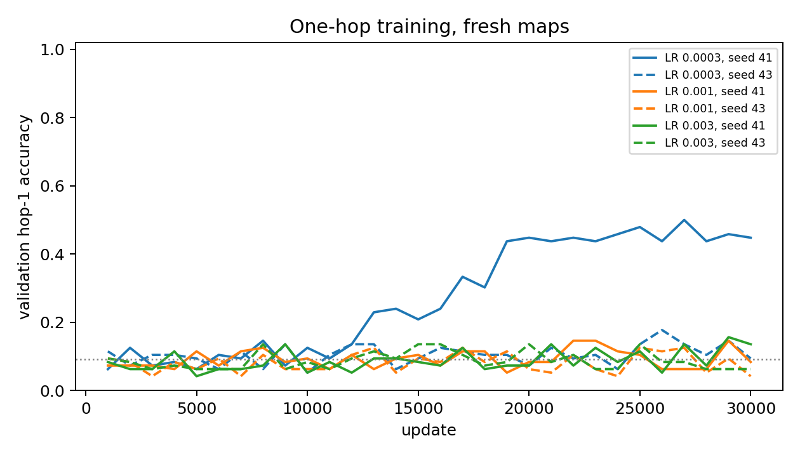
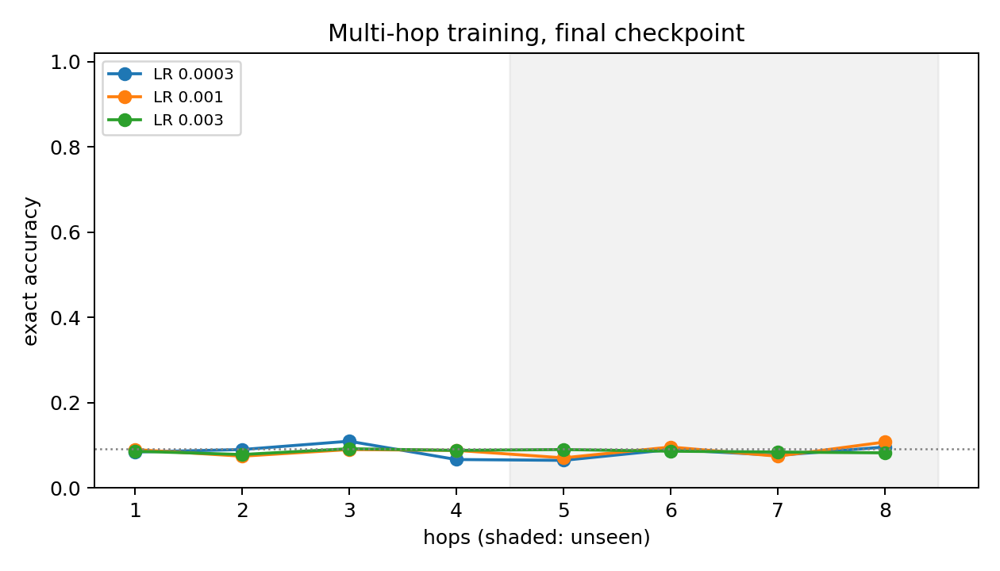

# Transformer pointer calibration (Stage 1a)

All 12 declared Transformer runs completed and were evaluated from checkpoints frozen at exactly 30,000 updates. Every training map was presented once. Chance is 1/11 = 9.09%. Development splits only; no test set exists for this study.

## One-hop learnability by learning rate

Hop-1 exact accuracy on 1,024 held-out `eval_id` maps (256 per hop), final checkpoint.

| Peak LR | seed 41 | seed 43 | Mean | First validation update with hop-1 ≥ 90% | Final train CE |
|---:|---:|---:|---:|---:|---:|
| 0.0003 | 51.95% | 7.42% | 29.69% | never, never | 0.8772 |
| 0.001 | 9.38% | 8.98% | 9.18% | never, never | 1.2198 |
| 0.003 | 7.42% | 7.81% | 7.62% | never, never | 1.2269 |

**D1 selected LR: 0.0003.** **D2: format NOT learnable** (mean 29.69%, lowest seed 7.42%; gate ≥ 90% mean, ≥ 80% each).

## Multi-hop training (hops 1–4), accuracy by hop

Hops 5–8 are unseen depths. Mean of both seeds (per-seed values in `summary.json`).

| Peak LR | hop 1 | hop 2 | hop 3 | hop 4 | hop 5 | hop 6 | hop 7 | hop 8 |
|---:|---:|---:|---:|---:|---:|---:|---:|---:|
| 0.0003 | 8.40% | 8.98% | 10.94% | 6.64% | 6.45% | 8.98% | 7.62% | 9.57% |
| 0.001 | 8.98% | 7.42% | 8.98% | 8.79% | 7.03% | 9.57% | 7.42% | 10.74% |
| 0.003 | 8.59% | 7.81% | 9.18% | 8.79% | 8.98% | 8.59% | 8.40% | 8.20% |

## Training

| Cell | Final train CE (last 100) | Train min | Peak GiB |
|---|---:|---:|---:|
| transformer_onehop_lr3e-4_seed41 | 0.5524 | 20.4 | 0.068 |
| transformer_onehop_lr1e-3_seed41 | 1.2175 | 20.7 | 0.068 |
| transformer_onehop_lr3e-3_seed41 | 1.2113 | 20.5 | 0.068 |
| transformer_multihop_lr3e-4_seed41 | 1.2011 | 20.8 | 0.068 |
| transformer_multihop_lr1e-3_seed41 | 1.2211 | 20.4 | 0.068 |
| transformer_multihop_lr3e-3_seed41 | 1.2131 | 20.9 | 0.068 |
| transformer_onehop_lr3e-4_seed43 | 1.2020 | 20.5 | 0.068 |
| transformer_onehop_lr1e-3_seed43 | 1.2221 | 20.6 | 0.068 |
| transformer_onehop_lr3e-3_seed43 | 1.2425 | 20.8 | 0.068 |
| transformer_multihop_lr3e-4_seed43 | 1.2021 | 20.5 | 0.068 |
| transformer_multihop_lr1e-3_seed43 | 1.2128 | 20.9 | 0.068 |
| transformer_multihop_lr3e-3_seed43 | 1.2273 | 20.8 | 0.068 |

See [frozen protocol](PLAN_BEFORE_RUNS.md), `registry.json`, `checkpoints.json` and the per-cell evaluation files.
