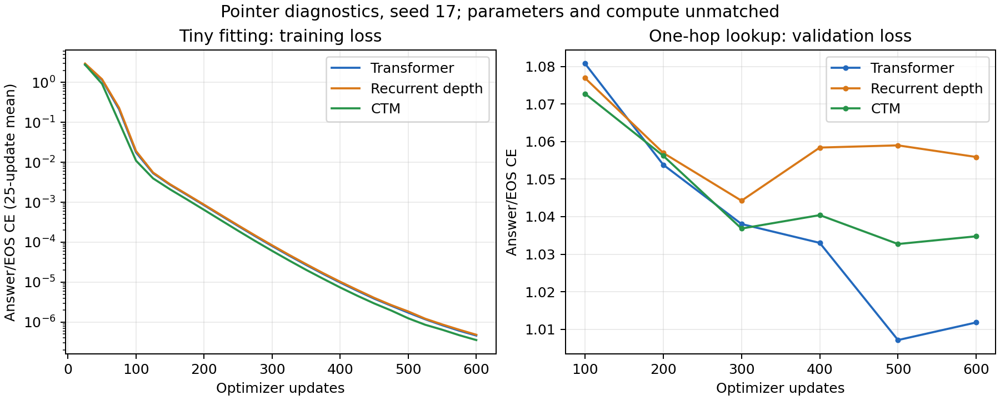

# Pointer diagnostic results

All six runs used the unchanged algorithmic model presets, seed 17, and 600 updates × 32 examples. Tiny fitting uses the final checkpoint; one-hop lookup uses best validation answer/EOS CE. Exact match requires a generated answer and EOS. Parameter and compute budgets are unmatched.

## Tiny-set fitting (32 fixed training examples)

| Model | Train | Paired train probe | Shuffled edges | New start | Held-out maps | Selected step | Training seconds |
|---|---:|---:|---:|---:|---:|---:|---:|
| Transformer | 100.0% | 100.0% | 25.0% | 6.2% | 14.8% | 600 | 18.5 |
| Recurrent depth | 100.0% | 100.0% | 15.6% | 3.1% | 15.6% | 600 | 53.3 |
| CTM | 100.0% | 100.0% | 21.9% | 3.1% | 16.4% | 600 | 94.3 |

Paired probes reuse training maps and are not held-out generalization scores. All 32 maps are probed.

## One-hop lookup (2,048 training maps)

| Model | Train | Paired train probe | Shuffled edges | New start | Held-out maps | Selected step | Training seconds |
|---|---:|---:|---:|---:|---:|---:|---:|
| Transformer | 16.1% | 16.4% | 16.4% | 12.5% | 14.1% | 500 | 18.4 |
| Recurrent depth | 13.2% | 12.1% | 10.9% | 13.3% | 8.6% | 300 | 50.1 |
| CTM | 15.8% | 15.2% | 15.2% | 13.3% | 14.8% | 500 | 95.4 |

Paired probes reuse training maps and are not held-out generalization scores. A fixed 256-map training subset is probed.

## Gates recorded before training

| Model | Tiny fitting ≥95% | Held-out one-hop ≥90% |
|---|---|---|
| Transformer | Pass | Fail |
| Recurrent depth | Pass | Fail |
| CTM | Pass | Fail |

Eight-node uniform guessing is 12.5%; excluding the known-impossible start node gives 14.3% expected accuracy without reading edges.

- tiny: always emit training-majority label `F` → 11.7% on held-out maps.
- onehop: always emit training-majority label `E` → 18.0% on held-out maps.

After changing the start node on the tiny training maps, the prediction still equals the old (now incorrect) answer in 24/32 cases for Transformer, 21/32 cases for Recurrent depth, 21/32 cases for CTM.

Training timing includes batching, transfers, forward/backward, and optimizer updates, excluding validation and checkpoint writes. Both GPU queues ran concurrently.

Per-example predictions and difficulty groups are in the adjacent `.eval.json` files. See the [protocol and interpretation](../../POINTER_DIAGNOSTICS.md) and the preserved [pre-run plan](PLAN_BEFORE_RUNS.md).
