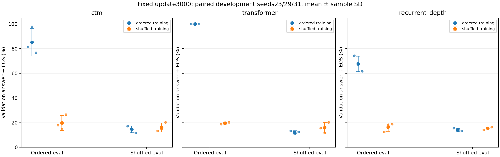
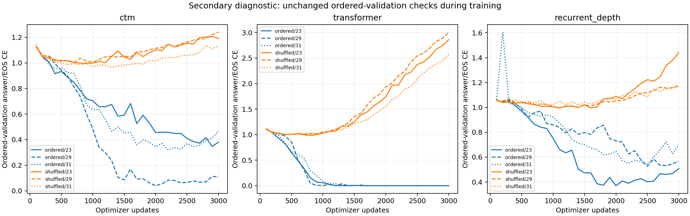

# Paired training-presentation control

All nine shuffled-training runs completed. Nine ordered-training runs are reused unchanged. Primary results use the checkpoint at exactly3,000 updates for every run, with family recipes/readouts fixed. Evaluation uses the same128 existing validation maps in ordered and shuffled presentations. No test set was evaluated.

## Primary: fixed-update validation accuracy

| Family | Training presentation | Ordered evaluation, mean ± SD | Shuffled evaluation, mean ± SD | Training min/run |
|---|---|---:|---:|---:|
| ctm | ordered | 85.16% ± 11.08 points | 14.58% ± 2.74 points | 31.9 |
| ctm | shuffled | 19.79% ± 6.07 points | 16.15% ± 3.69 points | 35.2 |
| transformer | ordered | 100.00% ± 0.00 points | 12.24% ± 1.19 points | 1.9 |
| transformer | shuffled | 19.53% ± 0.78 points | 15.89% ± 4.30 points | 1.6 |
| recurrent_depth | ordered | 67.71% ± 6.27 points | 14.06% ± 1.35 points | 15.8 |
| recurrent_depth | shuffled | 16.41% ± 3.41 points | 15.36% ± 1.19 points | 18.1 |

SD is sample standard deviation across seeds23/29/31, not a confidence interval. These are development seeds on shared validation maps, not new confirmatory replications. Exact accuracy requires unrestricted correct answer+EOS generation.

## Primary: fixed-update answer/EOS CE

| Family | Training presentation | Ordered CE, mean ± SD | Shuffled CE, mean ± SD |
|---|---|---:|---:|
| ctm | ordered | 0.319277 ± 0.187 | 3.31515 ± 0.889 |
| ctm | shuffled | 1.18815 ± 0.0535 | 1.2784 ± 0.0688 |
| transformer | ordered | 4.87392e-08 ± 7.84e-08 | 7.41743 ± 0.229 |
| transformer | shuffled | 2.8117 ± 0.226 | 3.03809 ± 0.209 |
| recurrent_depth | ordered | 0.591714 ± 0.0983 | 2.7279 ± 0.449 |
| recurrent_depth | shuffled | 1.26133 ± 0.156 | 1.2886 ± 0.0904 |

CE is token-weighted and teacher-forced over answer/EOS.

## Paired effects of shuffled training

| Family and evaluation presentation | Accuracy difference, mean ± SD (points) | CE difference, mean ± SD |
|---|---:|---:|
| ctm_validation | -65.36 ± 16.51 | +0.868876 ± 0.238 |
| ctm_validation_shuffled | +1.56 ± 6.39 | -2.03675 ± 0.957 |
| transformer_validation | -80.47 ± 0.78 | +2.8117 ± 0.226 |
| transformer_validation_shuffled | +3.65 ± 3.69 | -4.37934 ± 0.0657 |
| recurrent_depth_validation | -51.30 ± 9.55 | +0.669618 ± 0.239 |
| recurrent_depth_validation_shuffled | +1.30 ± 2.51 | -1.4393 ± 0.359 |

Each difference pairs the same family, initialization/data-order seed, semantic examples, final-update budget, readout and evaluation presentation. Positive accuracy differences favor shuffled training. No significance claim is implied by three seeds.

## Every primary endpoint

| Family | Training | Seed | Ordered accuracy | Shuffled accuracy | Ordered CE | Shuffled CE | Train min | Peak GiB |
|---|---|---:|---:|---:|---:|---:|---:|---:|
| ctm | ordered | 23 | 81.25% | 17.19% | 0.380661 | 2.7766 | 31.4 | 2.304 |
| ctm | ordered | 29 | 97.66% | 14.84% | 0.109476 | 4.34073 | 32.4 | 2.304 |
| ctm | ordered | 31 | 76.56% | 11.72% | 0.467693 | 2.82813 | 31.9 | 2.312 |
| ctm | shuffled | 23 | 17.97% | 13.28% | 1.19009 | 1.32863 | 35.0 | 2.304 |
| ctm | shuffled | 29 | 14.84% | 14.84% | 1.24067 | 1.19999 | 34.7 | 2.304 |
| ctm | shuffled | 31 | 26.56% | 20.31% | 1.1337 | 1.30658 | 35.9 | 2.312 |
| transformer | ordered | 23 | 100.00% | 13.28% | 4.19095e-09 | 7.44141 | 1.9 | 0.059 |
| transformer | ordered | 29 | 100.00% | 10.94% | 2.79397e-09 | 7.63336 | 1.8 | 0.059 |
| transformer | ordered | 31 | 100.00% | 12.50% | 1.39233e-07 | 7.17753 | 1.9 | 0.059 |
| transformer | shuffled | 23 | 18.75% | 15.62% | 2.8603 | 2.99098 | 1.6 | 0.059 |
| transformer | shuffled | 29 | 19.53% | 11.72% | 3.00906 | 3.26657 | 1.3 | 0.059 |
| transformer | shuffled | 31 | 20.31% | 20.31% | 2.56574 | 2.85673 | 1.8 | 0.059 |
| recurrent_depth | ordered | 23 | 74.22% | 15.62% | 0.507633 | 3.23254 | 15.6 | 0.418 |
| recurrent_depth | ordered | 29 | 67.19% | 13.28% | 0.567727 | 2.37322 | 15.4 | 0.418 |
| recurrent_depth | ordered | 31 | 61.72% | 13.28% | 0.699782 | 2.57793 | 16.3 | 0.418 |
| recurrent_depth | shuffled | 23 | 12.50% | 14.06% | 1.44087 | 1.38953 | 18.3 | 0.418 |
| recurrent_depth | shuffled | 29 | 17.97% | 15.62% | 1.17527 | 1.21522 | 18.3 | 0.418 |
| recurrent_depth | shuffled | 31 | 18.75% | 16.41% | 1.16785 | 1.26105 | 17.7 | 0.418 |

## Secondary: ordered-validation-selected checkpoints

Both training conditions retained the existing ordered-validation selection procedure. These secondary scores are selected on that same validation set and do not replace the fixed-update primary endpoints. Shuffled-validation outcomes were never used to select a checkpoint.

| Family | Training | Selected ordered accuracy, mean ± SD | Selected ordered CE, mean ± SD |
|---|---|---:|---:|
| ctm | ordered | 85.42% ± 11.52 points | 0.235125 ± 0.17 |
| ctm | shuffled | 15.10% ± 5.54 points | 0.988244 ± 0.0199 |
| transformer | ordered | 100.00% ± 0.00 points | 4.79631e-08 ± 7.9e-08 |
| transformer | shuffled | 15.89% ± 4.01 points | 0.995332 ± 0.0102 |
| recurrent_depth | ordered | 66.93% ± 4.30 points | 0.479606 ± 0.0955 |
| recurrent_depth | shuffled | 17.45% ± 3.25 points | 1.00281 ± 0.0143 |

## Controls and interpretation limits

- Training file order, semantic maps, starts, queries, answers, masked targets, sequence lengths and example/token budgets are paired. Only training edge presentation changes. All2,048 training maps and128 validation maps come from the existing development splits; no semantic training/validation overlap is introduced.
- One noncanonical presentation is fixed per map, shared across families/seeds and repeated each epoch. This is not online augmentation or an estimate over multiple shuffle-generator realizations. Ordered and shuffled evaluations reuse the same maps.
- CTM keeps uniform supervision/LR0.0003/confidence readout; Transformer keeps final CE/LR0.0003/final readout; recurrent depth keeps final CE/LR0.001/confidence readout. T16 is fixed for CTM/recurrent. Recipes were selected under ordered training and are not retuned here.
- Every run receives96,000 example presentations,5,184,000 input tokens and192,000 answer/EOS labels. Approximate parameter matching and equal exposure do not equalize family compute or prior tuning. Full-budget training-loop wall times are reported, not measured FLOPs.
- Five new data/replay checks passed, including exact archived CTM/Transformer GPU replay; the previous recurrent control verified its archived final-CE replay. Both source versions are retained. All54,000 updates are audited, including27,000 newly trained updates.
- Final checkpoint files retain legacy final-readout metadata; the frozen registry/evaluation explicitly applies the declared family readout. Final checkpoint identities were frozen before paired evaluation.
- These results address one-hop lookup at existing recipes and budgets. Reliable retrieval, new confirmation, optimizer/schedule controls, and compute accounting remain prerequisites for broader claims. No completed test set was reopened.

See [frozen protocol](PLAN_BEFORE_RUNS.md), `registry.json`, `checkpoints.json`, per-example evaluation files and source/checkpoint manifests.
