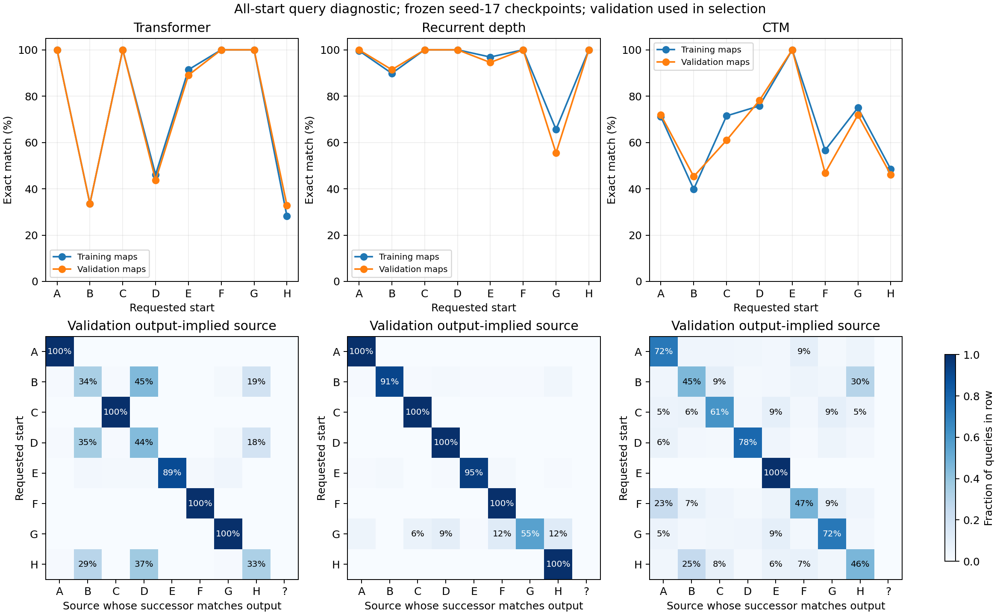

# All-start query-selection results

Frozen checkpoints from the 3,000-update experiment. Each model answers every start A–H on the same 256 training-probe maps and 128 validation maps. Original queries reproduce the prior outputs exactly. No training or checkpoint reselection occurred.

| Model | Training maps, all starts | Validation maps, all starts | Training maps: all 8 correct | Validation maps: all 8 correct |
|---|---:|---:|---:|---:|
| Transformer | 74.9% | 74.9% | 2/256 | 0/128 |
| Recurrent depth | 94.0% | 92.7% | 150/256 | 64/128 |
| CTM | 67.3% | 65.1% | 3/256 | 0/128 |

All-start columns contain 2,048 training-map and 1,024 validation-map queries per model. Queries on the same map are correlated; the all-eight metric uses maps as the unit. Validation maps were used for checkpoint selection and are not a new independent test set.

## Query exposure

| Model | Original trained query (256) | Changed query, training map (1,792) | Original validation query (128) | Changed validation query (896) |
|---|---:|---:|---:|---:|
| Transformer | 84.0% | 73.6% | 68.8% | 75.8% |
| Recurrent depth | 94.1% | 94.0% | 91.4% | 92.9% |
| CTM | 83.6% | 65.0% | 65.6% | 65.1% |

## Validation accuracy by requested start

| Start | Transformer | Recurrent depth | CTM |
|---|---:|---:|---:|
| A | 128/128 (100.0%) | 128/128 (100.0%) | 92/128 (71.9%) |
| B | 43/128 (33.6%) | 117/128 (91.4%) | 58/128 (45.3%) |
| C | 128/128 (100.0%) | 128/128 (100.0%) | 78/128 (60.9%) |
| D | 56/128 (43.8%) | 128/128 (100.0%) | 100/128 (78.1%) |
| E | 114/128 (89.1%) | 121/128 (94.5%) | 128/128 (100.0%) |
| F | 128/128 (100.0%) | 128/128 (100.0%) | 60/128 (46.9%) |
| G | 128/128 (100.0%) | 71/128 (55.5%) | 92/128 (71.9%) |
| H | 42/128 (32.8%) | 128/128 (100.0%) | 59/128 (46.1%) |

## Output sensitivity on validation maps

| Model | Identical-output start pairs (of 3,584) | Changed queries returning original answer (of 896) | Invalid outputs (of 1,024) |
|---|---:|---:|---:|
| Transformer | 306 (8.5%) | 42 (4.7%) | 0 |
| Recurrent depth | 75 (2.1%) | 13 (1.5%) | 0 |
| CTM | 272 (7.6%) | 48 (5.4%) | 0 |

Pairs compare the full generated string and EOS status. Original-answer persistence requires exact generation with EOS. Neither metric measures internal attention.

The lower panels invert each graph to identify which source has the predicted value as its successor. Rows are requested starts; columns are output-implied sources. The diagonal is correct. “?” covers invalid labels or missing EOS. This is a behavioral association, not evidence of which edge received attention. Source labels and positions are confounded by canonical ordering.

See [protocol and interpretation](../../QUERY_DIAGNOSTIC.md), the immutable [pre-evaluation plan](PLAN_BEFORE_RUNS.md), and `query_summary.json` for per-map counts, exposure breakdowns, original-query reproduction audits, and hashes. These one-seed results use unmatched model sizes/compute.
