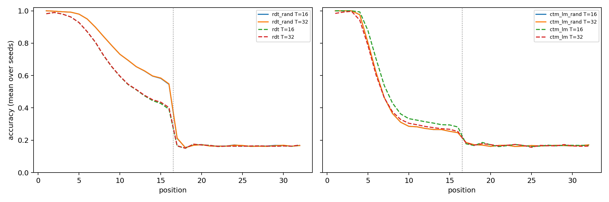

# S3 randomized-depth training versus fixed depth

RDT and CTM-LM trained with {'kind': 'lognormal_poisson', 'mean': 15, 'sigma': 0.5, 'maximum': 48} (expected depth about 16), paired by seed and data with the fixed-T=16 runs of the reliability study (20 seeds). Escape: mean accuracy over positions 9–16 ≥ 90%. Evaluation words have length 32.

| Cell | Escape at T=16 | 95% CI | Escape at T=32 | Positions 1–16 at T=16 | Positions 17–32 at T=32 | Median prefix T=4/8/16/32/48/64 |
|---|---:|---|---:|---:|---:|---|
| rdt_rand | 7/20 | 15.4%–59.2% | 7/20 | 80.4% | 16.8% | 6/8.5/9.5/9.5/9.5/9.5 |
| rdt | 2/20 | 1.2%–31.7% | 2/20 | 70.5% | 16.5% | 2/4/5.5/5.5/—/— |
| ctm_lm_rand | 0/20 | 0.0%–16.8% | 0/20 | 52.6% | 16.8% | 4/4/4/4/4/4 |
| ctm_lm | 0/20 | 0.0%–16.8% | 0/20 | 56.6% | 16.9% | 0/1/4/4/—/— |

## Declared paired tests (Holm over all six)

| Comparison | Metric | Effect | p | p (Holm) |
|---|---|---|---:|---:|
| rdt_rand vs rdt | escape at T=16 (paired exact McNemar) | 6 vs 1 discordant | 0.1250 | 0.4654 |
| rdt_rand vs rdt | mean accuracy positions 1-16 at T=16 (paired sign-flip) | mean diff +9.9 points | 0.0619 | 0.3097 |
| rdt_rand vs rdt | mean accuracy positions 17-32 at T=32 (paired sign-flip) | mean diff +0.3 points | 0.1164 | 0.4654 |
| ctm_lm_rand vs ctm_lm | escape at T=16 (paired exact McNemar) | 0 vs 0 discordant | 1.0000 | 1.0000 |
| ctm_lm_rand vs ctm_lm | mean accuracy positions 1-16 at T=16 (paired sign-flip) | mean diff -4.0 points | 0.0416 | 0.2495 |
| ctm_lm_rand vs ctm_lm | mean accuracy positions 17-32 at T=32 (paired sign-flip) | mean diff -0.1 points | 0.6722 | 1.0000 |

See [frozen protocol](PLAN_BEFORE_RUNS.md), `registry.json`, `checkpoints.json` and the per-run evaluation files.
