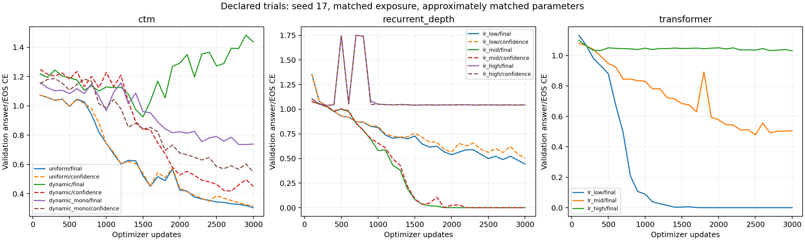
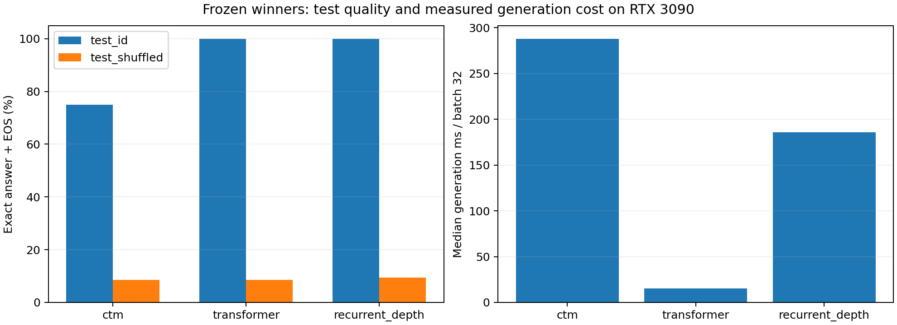

# Across-tick CTM recipe and baseline comparison

All nine declared trials completed. Three new tuning trials per family, one training seed, identical data exposure, and approximately matched trainable parameters. Validation selects trial, checkpoint and declared readout; frozen winners alone receive test evaluation. This is not a compute-matched or multi-seed architecture result. Earlier project work has inspected these test splits; fresh confirmatory data remain necessary.

## Frozen winners

| Family | Recipe | Readout | Selected update | Parameters | Validation CE | Ordered test accuracy | Shuffled test accuracy | Train min (full budget) | Generation ms / batch 32 |
|---|---|---|---:|---:|---:|---:|---:|---:|---:|
| ctm | ctm_uniform | final | 3000 | 544,839 | 0.305035 | 75.0% | 8.6% | 33.4 | 287.8 |
| transformer | transformer_lr_low | final | 2900 | 548,660 | 6.0536e-09 | 100.0% | 8.6% | 1.9 | 15.1 |
| recurrent_depth | recurrent_depth_lr_mid | confidence | 3000 | 525,984 | 3.67872e-08 | 100.0% | 9.4% | 14.9 | 185.6 |

Both accuracies require unconstrained generation of the answer and EOS. Test CE and per-example predictions are retained in the evaluation JSON. Confidence readout executes all 16 ticks and selects separately for each generated token; it is not early stopping. Generation timing includes its overhead and repeated-prefix decoding on one RTX 3090. Training time covers all 3,000 updates, even when an earlier checkpoint wins.

## All declared tuning trials

| Trial | Selected readout | Update | Validation CE | Validation generation accuracy | Train min | Total run min | Peak GiB |
|---|---|---:|---:|---:|---:|---:|---:|
| ctm_uniform | final | 3000 | 0.305035 | 76.6% | 33.4 | 35.2 | 2.312 |
| ctm_dynamic | confidence | 2700 | 0.418433 | 73.4% | 33.0 | 34.7 | 2.304 |
| ctm_dynamic_mono | confidence | 3000 | 0.548063 | 64.1% | 33.4 | 35.1 | 2.304 |
| transformer_lr_low | final | 2900 | 6.0536e-09 | 100.0% | 1.9 | 2.0 | 0.059 |
| transformer_lr_mid | final | 2500 | 0.478233 | 61.7% | 1.9 | 2.0 | 0.059 |
| transformer_lr_high | final | 3000 | 1.03094 | 14.1% | 1.9 | 2.0 | 0.059 |
| recurrent_depth_lr_low | final | 3000 | 0.443467 | 64.8% | 15.1 | 16.1 | 0.418 |
| recurrent_depth_lr_mid | confidence | 3000 | 3.67872e-08 | 100.0% | 14.9 | 15.9 | 0.418 |
| recurrent_depth_lr_high | final | 300 | 1.03813 | 13.3% | 15.4 | 16.3 | 0.418 |

## Development cost

| Family | New trials | Training GPU min | Total run GPU min |
|---|---:|---:|---:|
| ctm | 3 | 99.8 | 105.0 |
| transformer | 3 | 5.6 | 5.9 |
| recurrent_depth | 3 | 45.3 | 48.3 |

Total run time includes validation and checkpoint work. These costs exclude earlier development, setup, profiling and final evaluation, so they are not total project costs. CTM has 32 training block applications per sequence; recurrent depth has 34 and Transformer 2. Their blocks have different costs; block counts are not FLOPs. Matching new trial counts does not match GPU budgets or lifetime tuning effort.

## Paired test differences

| CTM minus baseline | Accuracy difference (points) | Paired map bootstrap 95% interval |
|---|---:|---|
| ctm_minus_transformer_test_id | -25.00 | [-32.81, -17.97] |
| ctm_minus_recurrent_depth_test_id | -25.00 | [-32.81, -17.97] |
| ctm_minus_transformer_test_shuffled | +0.00 | [-5.47, +5.47] |
| ctm_minus_recurrent_depth_test_shuffled | -0.78 | [-6.25, +4.69] |

These intervals resample 128 maps, not training seeds. Ordered and shuffled outcomes reuse the same maps; the intervals are descriptive and not adjusted for multiple comparisons.

## Validation trajectories

See [tick dynamics](TICK_DYNAMICS.md) for the direct raw/confidence/oracle monotonicity diagnosis at all three CTM recipe checkpoints.

## What this run establishes

At its selected checkpoint, dynamic CTM with confidence selection shows zero aggregate answer-token CE regressions and zero accuracy regressions over the 15 adjacent tick transitions. Uniform has 9 and 3 respectively. This reproduces the reported monotonic trajectory pattern under a label-free selector on this validation set; it is not a per-example or general guarantee. Nevertheless, uniform finishes at a better absolute validation score (76.6% generation accuracy versus 73.4% dynamic). The chosen monotonic penalty lowers dynamic accuracy to 64.1%.

Optimizer settings strongly affect the baseline comparison: the standard Transformer reaches 100% validation accuracy at peak LR 3e-4, versus 61.7% at 1e-3 and 14.1% at 3e-3. CTM learning rate was fixed at 1e-3 while its temporal objective was varied. A dedicated CTM learning-rate study is a sensible next development step, before freezing a broader architecture comparison.

All three frozen winners fail shuffled-order transfer (8.6–9.4%). The near-perfect ordered baseline results establish fixed-order lookup on this task, not general graph retrieval or multistep reasoning. This limitation motivates shuffled-order training and fresh confirmatory maps.

## Interpretation limits

- Three CTM temporal recipes were compared with three learning rates for each final-CE baseline. This compares complete recipes; it does not isolate auxiliary supervision from architecture. A recurrent baseline with identical auxiliary temporal losses remains a required attribution control.
- Single seed and one elementary ordered lookup task. Approximate parameter match and equal exposure are explicit; compute, architecture-specific state and historical tuning are unequal.
- The exact earlier successful CTM recipe remains unidentified. The monotonic penalty is soft; minimum-entropy selection does not guarantee monotonic accuracy. Gold-aware envelopes are diagnostics only.
- Fresh test maps, seed replication, harder composition tasks, and compute-matched baselines are needed before paper-level claims. No post-test retuning is part of this study.

See [frozen protocol](PLAN_BEFORE_RUNS.md), `selection.json`, `registry.json`, source snapshots, all retained validation checkpoints, and per-example evaluation files.
