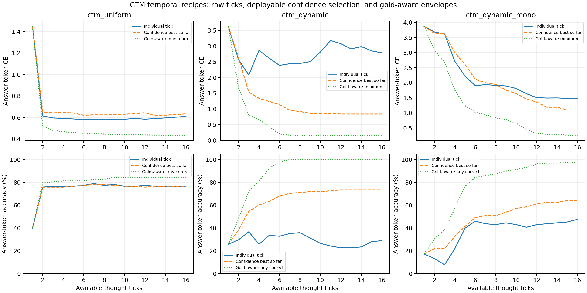

# Tick dynamics at frozen CTM checkpoints

Validation-only answer-token diagnostics. Each recipe uses its own selected checkpoint; these are not answer-plus-EOS generation scores. A fixed checkpoint is unrolled once and read at every tick. No additional tuning follows this analysis.

| Recipe | CE regressions: raw / confidence | Accuracy regressions: raw / confidence | Confidence answer accuracy at T16 |
|---|---:|---:|---:|
| ctm_uniform | 8 / 9 | 3 / 3 | 76.6% |
| ctm_dynamic | 7 / 0 | 6 / 0 | 73.4% |
| ctm_dynamic_mono | 2 / 1 | 6 / 0 | 64.1% |

Regressions count adjacent transitions among15transitions, using tolerance1e-7. The soft training penalty acts on training batch-mean raw CE; it does not guarantee validation monotonicity. Confidence refers to minimum entropy among available ticks, not known correctness. Gold-aware envelopes improve by construction and cannot be treated as deployment results. Any-correct coverage can also rise simply by offering more diverse candidates among the eight answer characters; it does not by itself establish iterative reasoning.

