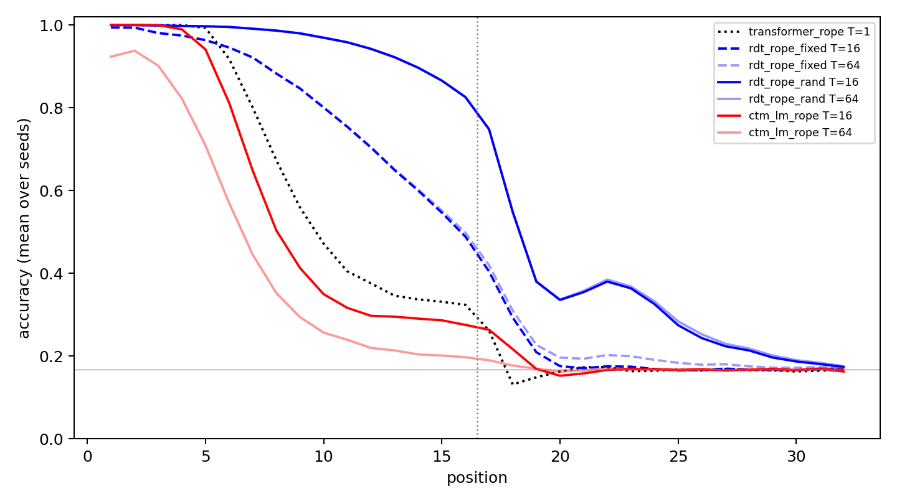

# S3 recipe confirmation with RoPE

Four cells × 30 new seeds, S₃ running products, training lengths 1–16, RoPE in every attention layer and no absolute position table. Escape: mean accuracy over positions 9–16 ≥ 90% at the trained budget (Transformer T=1, others T=16). Evaluation words have length 32; positions 17–32 measure length extrapolation (recurrent cells at T=32).

| Cell | Escaped | 95% CI | Positions 1–16 | Positions 17–24 | Positions 25–32 | Median prefix T=4/8/16/32/48/64 |
|---|---:|---|---:|---:|---:|---|
| transformer_rope | 0/30 | 0.0%–11.6% | 65.8% | 17.2% | 16.6% | 6 (T=1) |
| rdt_rope_fixed | 0/30 | 0.0%–11.6% | 81.5% | 24.2% | 17.5% | 3/7/8/8/8/8 |
| rdt_rope_rand | 24/30 | 61.4%–92.3% | 95.8% | 43.2% | 21.7% | 10/15/15/15/15/15 |
| ctm_lm_rope | 0/30 | 0.0%–11.6% | 58.9% | 17.5% | 16.7% | 0/0/5/4/3.5/2 |

## Declared paired tests (Holm over all four)

| Test | Comparison | Metric | Effect | p | p (Holm) |
|---|---|---|---|---:|---:|
| T1 | rdt_rope_rand vs rdt_rope_fixed | mean accuracy positions 1-16 at T=16 (paired sign-flip) | mean diff +14.3 points | 0.0000 | 0.0000 |
| T2 | rdt_rope_rand vs rdt_rope_fixed | escape at T=16 (paired exact McNemar) | 24 vs 0 discordant | 0.0000 | 0.0000 |
| T3 | rdt_rope_rand vs transformer_rope | mean accuracy positions 17-24 (RDT at T=32; paired sign-flip) | mean diff +26.0 points | 0.0000 | 0.0000 |
| T4 | ctm_lm_rope vs rdt_rope_fixed | mean accuracy positions 1-16 at T=16 (paired sign-flip) | mean diff -22.7 points | 0.0000 | 0.0000 |

## Secondary (not corrected)

| Comparison | Metric | Effect | p |
|---|---|---|---:|
| rdt_rope_fixed vs transformer_rope | mean accuracy positions 1-16 at the trained budget (paired sign-flip; not corrected) | mean diff +15.7 points | 0.0000 |
| rdt_rope_fixed vs transformer_rope | mean accuracy positions 17-24 (RDT at T=32; paired sign-flip; not corrected) | mean diff +7.0 points | 0.0000 |

Sign-flip p-values use 2,000,000 seeded Monte Carlo sign assignments with the +1 correction; McNemar is exact.

See [frozen protocol](PLAN_BEFORE_RUNS.md), `registry.json`, `checkpoints.json` and the per-run evaluation files.
