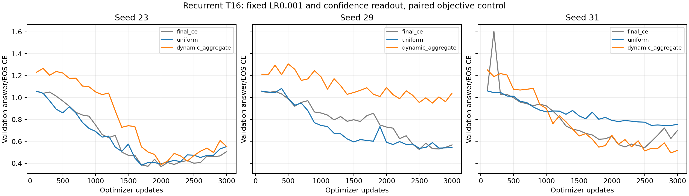
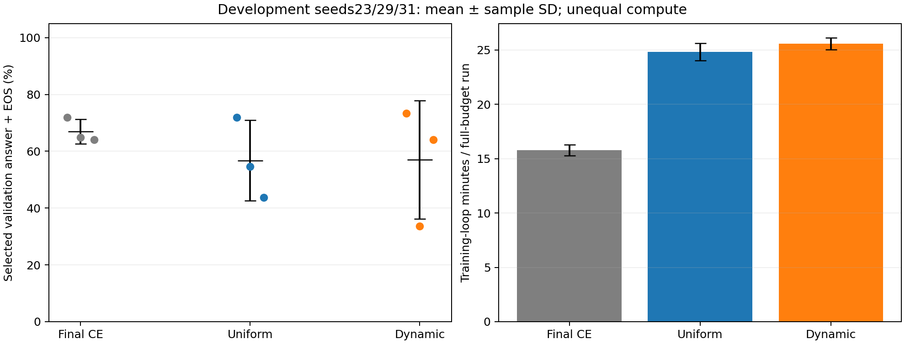

# Recurrent temporal-supervision control

All six new auxiliary-objective runs completed. Three final-CE runs are reused unchanged. Each objective uses the same recurrent architecture, LR0.001, T16, data exposure, paired seeds23/29/31 and confidence readout. Results below use original validation data only. No test forward was performed.

## Selected validation results

| Objective | Accuracy, mean ± SD | CE, mean ± SD | Training min/run, mean ± SD |
|---|---:|---:|---:|
| final_ce | 66.93% ± 4.30 points | 0.479606 ± 0.0955 | 15.8 ± 0.5 |
| uniform | 56.77% ± 14.18 points | 0.555137 ± 0.182 | 24.8 ± 0.8 |
| dynamic_aggregate | 57.03% ± 20.83 points | 0.610493 ± 0.298 | 25.6 ± 0.6 |

SD is the sample standard deviation over three development seeds, not a confidence interval. Each seed selects its checkpoint by minimum confidence-readout validation CE; accuracy requires unrestricted correct answer+EOS generation. The same128 maps are used across seeds and objectives. Selection on these maps makes these development scores, not held-out confirmation.

## Every declared cell

| Objective | Seed | Update | Validation CE | Validation accuracy | Train min | Run min | Peak GiB | Reused |
|---|---:|---:|---:|---:|---:|---:|---:|---|
| final_ce | 23 | 2000 | 0.369748 | 71.88% | 15.6 | 16.3 | 0.418 | yes |
| uniform | 23 | 1700 | 0.382831 | 71.88% | 25.5 | 26.3 | 0.649 | no |
| dynamic_aggregate | 23 | 2000 | 0.387491 | 73.44% | 26.2 | 27.0 | 0.651 | no |
| final_ce | 29 | 2500 | 0.526357 | 64.84% | 15.4 | 16.2 | 0.418 | yes |
| uniform | 29 | 2500 | 0.536964 | 54.69% | 24.0 | 24.8 | 0.649 | no |
| dynamic_aggregate | 29 | 2700 | 0.949347 | 33.59% | 25.2 | 25.9 | 0.651 | no |
| final_ce | 31 | 2500 | 0.542712 | 64.06% | 16.3 | 17.1 | 0.418 | yes |
| uniform | 31 | 2900 | 0.745615 | 43.75% | 24.9 | 25.7 | 0.649 | no |
| dynamic_aggregate | 31 | 2900 | 0.494641 | 64.06% | 25.4 | 26.1 | 0.651 | no |

## Paired objective differences

| Auxiliary minus final CE | Accuracy difference, mean ± SD (points) | CE difference, mean ± SD |
|---|---:|---:|
| uniform_minus_final_ce | -10.16 ± 10.16 | +0.0755309 ± 0.11 |
| dynamic_aggregate_minus_final_ce | -9.90 ± 18.51 | +0.130887 ± 0.255 |

The JSON retains per-seed paired differences and per-map predictions. No statistical-significance claim is made from three seeds.

## Correctness and cost

- Eleven GPU checks passed: exact CTM objective/gradient parity at T16 under FP32/BF16, masking and earliest ties, independent recurrent truncations/gradients, unchanged initialization and inference, checkpoint metadata and exact archived final-CE training replay.
- Every run receives96,000 example presentations,5,184,000 input tokens and192,000 supervised answer/EOS labels. Parameters remain525,984.
- Uniform and dynamic auxiliary training decode each recurrent state using the same coda/head without feeding decoded states back. Both execute49 decoder blocks per sequence versus34 for final CE. Counts are not FLOPs. Training-loop time includes the full3,000 updates.
- Dynamic training uses CTM native-logits-dtype certainty; inference confidence uses FP32 entropy. The minimum-CE branch uses labels during training only. No monotonic penalty is added.
- Reused controls are checked against their archived source bytes and checkpoint/metric hashes. The current runner extension preserves the default final-CE path; original archives remain unchanged.

## Interpretation limits

This isolates the temporal objective within one recurrent architecture at a fixed learning rate and fixed data exposure. Extra auxiliary decoding increases compute. Objectives may have different optimizer preferences; the fixed-LR result is not an exhaustive comparison of their attainable performance. The seeds were already examined in the preceding confirmation and are explicitly development seeds here.

These results do not establish a broad architecture ranking or reproduce an unidentified historical CTM recipe. Any revised recipe requires a separately declared confirmation; the preceding fresh test set remains closed. Shuffled-training and multistep-task controls remain separate work.

See [frozen plan](PLAN_BEFORE_RUNS.md), `registry.json`, `summary.json`, all saved validation checkpoints and source snapshots.
