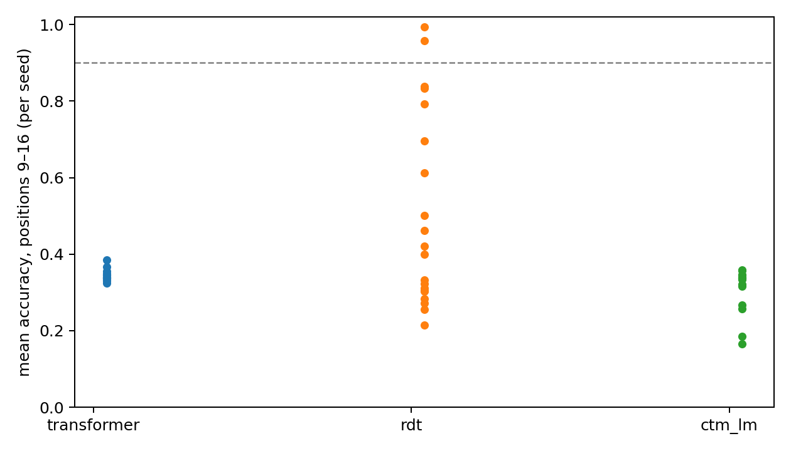

# S3 reliability: escape probability over twenty seeds

60 runs (3 cells × 20 seeds), S₃ running products, training lengths 1–16, 10,000 updates, peak LR 0.0003. Evaluation: 1,024 held-out length-32 words per seed, evaluated once after the freeze. A run **escapes** if its mean accuracy over positions 9–16 at the trained budget (Transformer T=1, others T=16) is ≥ 90%.

## Primary: escape probability

| Cell | Parameters | Escaped | Probability | 95% CI (Clopper–Pearson) | Mean accuracy, positions 1–16 | Median correct prefix | Train min |
|---|---:|---:|---:|---|---:|---:|---:|
| transformer | 548,660 | 0/20 | 0.0% | 0.0%–16.8% | 60.4% | 5 | 5 |
| rdt | 525,984 | 2/20 | 10.0% | 1.2%–31.7% | 70.5% | 5.5 | 52 |
| ctm_lm | 636,928 | 0/20 | 0.0% | 0.0%–16.8% | 56.6% | 4 | 45 |

## Declared paired tests (Holm-corrected over all four)

| Comparison | Metric | Effect | p | p (Holm) |
|---|---|---|---:|---:|
| rdt vs transformer | mean accuracy positions 1-16 (paired sign-flip) | mean diff +10.1 points | 0.0073 | 0.0220 |
| rdt vs transformer | escape (paired exact McNemar) | 2 vs 0 discordant | 0.5000 | 1.0000 |
| ctm_lm vs rdt | mean accuracy positions 1-16 (paired sign-flip) | mean diff -13.9 points | 0.0003 | 0.0013 |
| ctm_lm vs rdt | escape (paired exact McNemar) | 0 vs 2 discordant | 0.5000 | 1.0000 |

## Tick use (median correct prefix at T=4/8/16/32)

- **rdt:** 2/4/5.5/5.5
- **ctm_lm:** 0/1/4/4

See [frozen protocol](PLAN_BEFORE_RUNS.md), `registry.json`, `checkpoints.json` and per-run evaluation files.
