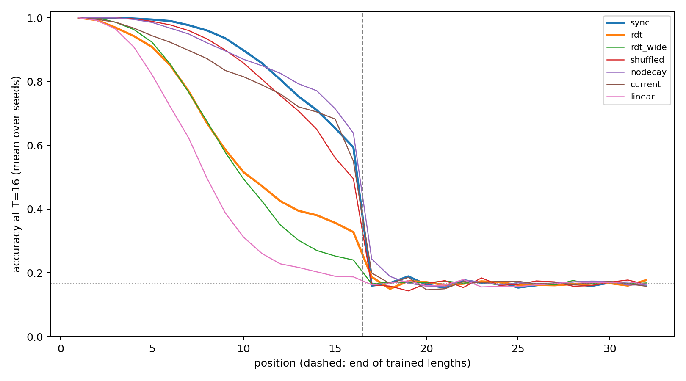

# Sync-RDT mechanism ablations (S3 word problem)

20 ablation runs (4 ablations × 5 seeds [47, 53, 59, 61, 67]) on the S3 study data, paired with its frozen `sync`, `rdt` and `rdt_wide` runs. Correct prefix = leading positions with at least 90% held-out accuracy on length-32 words, at T=16. Development data; no test set.

| Cell | Correct prefix per seed | Median | Mean accuracy, positions 9–16 | Median prefix at T=4/8/16/32 |
|---|---|---:|---:|---|
| sync | 12, 10, 7, 16, 10 | 10 | 77.6% | 3/7/10/11 |
| rdt | 4, 3, 5, 8, 8 | 5 | 43.3% | 2/5/5/5 |
| rdt_wide | 4, 6, 4, 5, 8 | 5 | 36.4% | 3/4/5/5 |
| shuffled | 11, 7, 11, 9, 7 | 9 | 71.7% | 3/6/9/8 |
| nodecay | 11, 5, 15, 16, 11 | 11 | 79.5% | 3/7/11/12 |
| current | 3, 9, 14, 15, 11 | 11 | 73.2% | 4/7/11/11 |
| linear | 6, 3, 4, 3, 3 | 3 | 24.8% | 1/3/3/3 |

## Declared classification

Removes: `sync` exceeds the ablation. Preserves: the ablation exceeds both `rdt` and `rdt_wide`. Otherwise partial. Rule: larger in ≥ 4 of 5 seeds, median difference ≥ 2 positions.

| Ablation | sync vs ablation (larger seeds, median) | ablation vs rdt | ablation vs rdt_wide | Uses steps (T16 vs T4) | Classification |
|---|---|---|---|---|---|
| shuffled | 4/1, +3 | 4/1, +4 | 4/1, +4 | yes | **removes** |
| nodecay | 2/2, +0 | 5/0, +7 | 4/1, +7 | yes | **preserves** |
| current | 3/2, +1 | 4/1, +6 | 4/1, +3 | yes | **preserves** |
| linear | 5/0, +7 | 1/3, -1 | 1/3, -2 | yes | **removes** |

**state: diverged at every seed** (non-finite gradient norm (clip_grad_norm_ error_if_nonfinite); last completed updates seed47: step 421, seed53: step 459, seed59: step 220, seed61: step 197, seed67: step 257). Recorded, not retried; see [amendment 1](AMENDMENT_1.md).

See [frozen protocol](PLAN_BEFORE_RUNS.md), `registry.json`, `checkpoints.json` and the per-run evaluation files.
