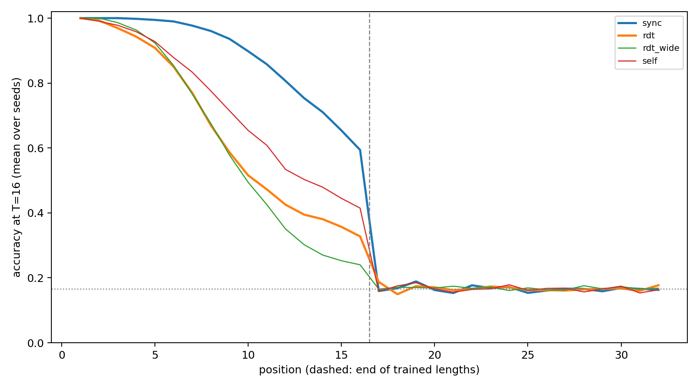

# Sync-RDT ablation A7: self-pairs only (S3 word problem)

5 ablation runs (1 ablations × 5 seeds [47, 53, 59, 61, 67]) on the S3 study data, paired with its frozen `sync`, `rdt` and `rdt_wide` runs. Correct prefix = leading positions with at least 90% held-out accuracy on length-32 words, at T=16. Development data; no test set.

| Cell | Correct prefix per seed | Median | Mean accuracy, positions 9–16 | Median prefix at T=4/8/16/32 |
|---|---|---:|---:|---|
| sync | 12, 10, 7, 16, 10 | 10 | 77.6% | 3/7/10/11 |
| rdt | 4, 3, 5, 8, 8 | 5 | 43.3% | 2/5/5/5 |
| rdt_wide | 4, 6, 4, 5, 8 | 5 | 36.4% | 3/4/5/5 |
| self | 15, 3, 6, 5, 11 | 6 | 54.4% | 1/3/6/6 |

## Declared classification

Removes: `sync` exceeds the ablation. Preserves: the ablation exceeds both `rdt` and `rdt_wide`. Otherwise partial. Rule: larger in ≥ 4 of 5 seeds, median difference ≥ 2 positions.

| Ablation | sync vs ablation (larger seeds, median) | ablation vs rdt | ablation vs rdt_wide | Uses steps (T16 vs T4) | Classification |
|---|---|---|---|---|---|
| self | 3/2, +1 | 3/1, +1 | 3/1, +2 | yes | **partial** |

See [frozen protocol](PLAN_BEFORE_RUNS.md), `registry.json`, `checkpoints.json` and the per-run evaluation files.
