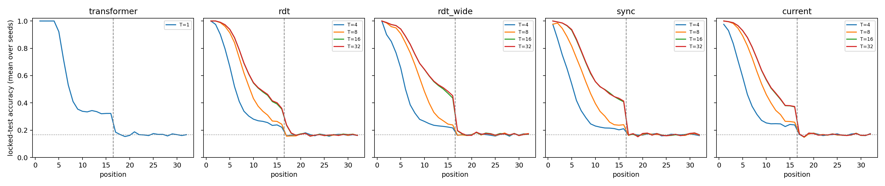

# Locked confirmation: second-order state features in the attention queries

35 runs (5 cells × 7 unused seeds [97, 101, 103, 107, 109, 113, 127]), S₃ running products, training lengths 1–16. The locked test (1,024 length-32 words per seed) was evaluated once, after the checkpoint freeze. Correct prefix = leading positions at ≥ 90% test accuracy. Rule: exceeds: larger in >= 6 of 7 seeds and median paired difference >= 2 positions.

## Primary: correct prefix on the locked test (Transformer T=1, others T=16)

| Cell | Parameters | Per seed | Median | Positions 9–16 | Positions 17–32 | Median prefix T=4/8/16/32 |
|---|---:|---|---:|---:|---:|---|
| transformer | 548,660 | 5, 5, 5, 5, 4, 4, 4 | 5 | 33.4% | 16.8% | — |
| rdt | 525,984 | 16, 6, 5, 5, 5, 7, 4 | 5 | 47.0% | 17.1% | 3/4/5/5 |
| rdt_wide | 565,900 | 16, 11, 2, 4, 5, 5, 10 | 5 | 55.3% | 17.2% | 2/4/5/5 |
| sync | 550,688 | 15, 7, 5, 13, 4, 5, 4 | 5 | 49.3% | 16.8% | 1/3/5/5 |
| current | 550,688 | 16, 4, 7, 6, 6, 4, 4 | 6 | 46.7% | 16.7% | 2/5/6/6 |

## Declared decisions

| Comparison (correct prefix) | Larger seeds (first/second) | Median difference | Exceeds |
|---|---:|---:|---|
| sync vs rdt | 2/3 | +0 | neither |
| sync vs rdt_wide | 2/4 | -1 | neither |
| current vs rdt | 3/2 | +0 | neither |
| current vs rdt_wide | 3/3 | +0 | neither |
| sync vs current | 3/3 | +0 | neither |
| rdt vs transformer | 4/0 | +1 | neither |
| rdt_wide vs rdt | 2/3 | +0 | neither |
| rdt: T=16 vs T=4 | 7/0 | +3 | yes |
| rdt_wide: T=16 vs T=4 | 7/0 | +4 | yes |
| sync: T=16 vs T=4 | 7/0 | +4 | yes |
| current: T=16 vs T=4 | 7/0 | +4 | yes |

- **C1 sync confirmed:** no
- **C2 current confirmed:** no
- **secondary sync exceeds current:** no
- **secondary current exceeds sync:** no
- **secondary rdt exceeds transformer:** no
- **secondary rdt uses steps:** yes
- **secondary rdt wide uses steps:** yes
- **secondary sync uses steps:** yes
- **secondary current uses steps:** yes

See [frozen protocol](PLAN_BEFORE_RUNS.md), `registry.json`, `checkpoints.json` and the per-run evaluation files.
