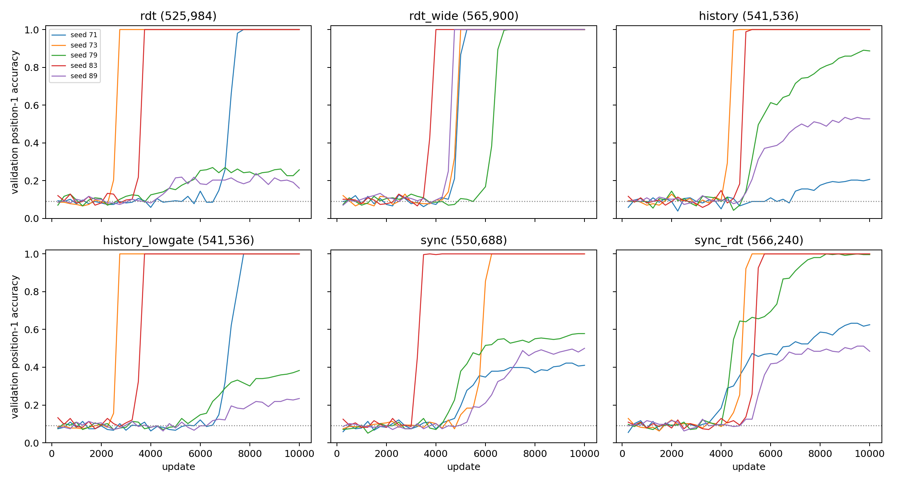

# Sync-RDT retrieval sample efficiency

30 runs (6 cells × 5 seeds [71, 73, 79, 83, 89]), 10,000 updates each, peak LR 0.0003, identical data per seed across cells. All-keys one-hop MQAR; confidence readout. Position-1 accuracy is leak-free (chance 1/11). Development study; no test set.

## Primary: validation updates to reach position-1 accuracy thresholds

Validation every 250 updates on 256 maps. ">10k": not reached (censored; ranked after every run that reaches it).

| Cell | Parameters | Updates to 50% (per seed) | Median | Updates to 90% (per seed) | Median |
|---|---:|---|---:|---|---:|
| rdt | 525,984 | 7.25k, 2.75k, >10k, 3.75k, >10k | 7.25k | 7.5k, 2.75k, >10k, 3.75k, >10k | 7.5k |
| rdt_wide | 565,900 | 5k, 5k, 6.5k, 4k, 4.75k | 5k | 5.25k, 5k, 6.75k, 4k, 4.75k | 5k |
| history | 541,536 | >10k, 4.5k, 5.75k, 5k, 7.25k | 5.75k | >10k, 4.5k, >10k, 5k, >10k | 10.25k |
| history_lowgate | 541,536 | 7.25k, 2.75k, >10k, 3.75k, >10k | 7.25k | 7.75k, 2.75k, >10k, 3.75k, >10k | 7.75k |
| sync | 550,688 | >10k, 6k, 6k, 3.5k, 10k | 6k | >10k, 6.25k, >10k, 3.5k, >10k | 10.25k |
| sync_rdt | 566,240 | 6.5k, 5k, 4.5k, 5.5k, 7.5k | 5.5k | >10k, 5k, 7k, 5.5k, >10k | 7k |

## Declared decisions (90% threshold)

| Comparison | Earlier seeds (first/second) | Median difference (updates, + favors first) | Favors |
|---|---:|---:|---|
| sync vs rdt | 1/2 | +0 | neither |
| sync vs rdt_wide | 1/4 | -3,500 | second |
| history vs rdt | 0/3 | -1,250 | neither |
| history_lowgate vs history | 3/0 | +1,250 | neither |
| history_lowgate vs rdt | 0/1 | +0 | neither |
| sync_rdt vs rdt | 1/3 | -1,750 | neither |
| sync_rdt vs sync | 2/1 | +0 | neither |
| rdt_wide vs rdt | 3/2 | +2,250 | neither |

- **sync speeds retrieval:** no
- **history slows retrieval:** no
- **history speeds retrieval:** no
- **lowgate explains history slowdown:** no

## Secondary: final held-out accuracy (512 maps per seed) and validation area

| Cell | Position 1, mean ± SD | Answer accuracy | All 12 correct | Validation position-1 area | Train min |
|---|---:|---:|---:|---:|---:|
| rdt | 69.14% ± 42.34 | 75.87% | 60.00% | 0.430 | 52 |
| rdt_wide | 100.00% ± 0.00 | 100.00% | 100.00% | 0.571 | 57 |
| history | 72.38% ± 33.35 | 79.96% | 47.73% | 0.400 | 63 |
| history_lowgate | 71.25% ± 39.56 | 78.89% | 60.00% | 0.426 | 62 |
| sync | 69.41% ± 28.62 | 77.26% | 40.00% | 0.400 | 62 |
| sync_rdt | 83.87% ± 23.06 | 88.41% | 59.73% | 0.452 | 73 |

See [frozen protocol](PLAN_BEFORE_RUNS.md), `registry.json`, `checkpoints.json` and the per-run evaluation files.
