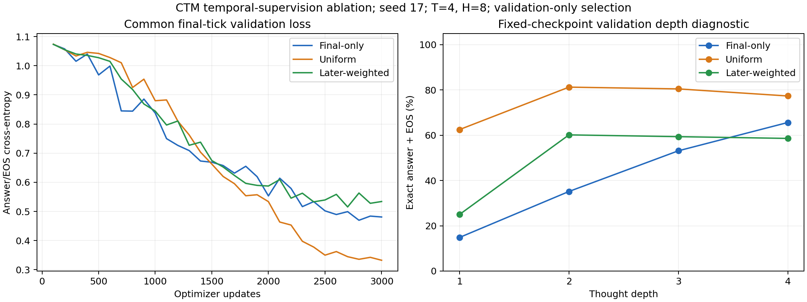

# CTM temporal-supervision ablation results

Three fresh seed-17 runs, each with four ticks, history length eight, and 3,000 updates on identical ordered one-hop training data. Only temporal CE weights vary. No held-out test split was evaluated.

| Recipe | Best final validation CE | Original validation accuracy | All-start validation accuracy | Validation maps: all 8 correct | Selected step | Train seconds | Peak GPU GiB |
|---|---:|---:|---:|---:|---:|---:|---:|
| Final-only | 0.469648 | 65.6% | 65.1% | 0/128 | 2800 | 542.8 | 0.653 |
| Uniform | 0.332454 | 77.3% | 77.7% | 12/128 | 3000 | 509.8 | 0.653 |
| Later-weighted | 0.515377 | 58.6% | 59.0% | 1/128 | 2700 | 575.6 | 0.655 |

**Selected by the recorded validation-CE rule: Uniform.** Ranking: Uniform → Final-only → Later-weighted.

Recipe selection uses original-validation final-tick CE, not auxiliary training loss, exact-match accuracy, or a preferred inference depth. Expanded validation queries share the same 128 maps and are secondary development measurements. Query outcomes within maps are correlated.

## Training and changed-query probes

| Recipe | Training accuracy | Training-map original query | Training-map changed query |
|---|---:|---:|---:|
| Final-only | 82.4% | 83.6% | 63.3% |
| Uniform | 91.1% | 92.6% | 77.0% |
| Later-weighted | 78.7% | 75.8% | 60.2% |

## Greedy validation accuracy at different thought depths

| Recipe | T=1 | T=2 | T=3 | T=4 |
|---|---:|---:|---:|---:|
| Final-only | 14.8% | 35.2% | 53.1% | 65.6% |
| Uniform | 62.5% | 81.2% | 80.5% | 77.3% |
| Later-weighted | 25.0% | 60.2% | 59.4% | 58.6% |

These scores require the correct answer and EOS. They differ from the earlier attention audit’s answer-token-only readouts. The checkpoint is fixed by T=4 validation CE; shorter depths are diagnostic and are not selected.

## All-start validation accuracy

| Start | Final-only | Uniform | Later-weighted |
|---|---:|---:|---:|
| A | 92/128 | 128/128 | 47/128 |
| B | 58/128 | 97/128 | 128/128 |
| C | 78/128 | 70/128 | 50/128 |
| D | 100/128 | 128/128 | 71/128 |
| E | 128/128 | 72/128 | 72/128 |
| F | 60/128 | 100/128 | 128/128 |
| G | 92/128 | 73/128 | 60/128 |
| H | 59/128 | 128/128 | 48/128 |

## Reproduction and budgets

The fresh final-only control selects update 2800; the historical control selected 2800. Maximum absolute training-loss difference over 3,000 updates: 0.

| Split | Identical predictions / examples |
|---|---:|
| train | 2048/2048 |
| validation | 128/128 |
| train_probe | 256/256 |
| train_new_query | 256/256 |

Every recipe sees 96,000 example presentations, 5,184,000 real input tokens, and 192,000 supervised labels. Weighted objectives reuse those labels at several readouts, adding backward work. Timing excludes evaluation/checkpoint work and is an implementation measurement, not FLOP accounting. Raw logs retain objective loss and each tick’s CE; curves below compare the common final-tick validation metric.

Eleven targeted runner checks passed before training. Post-run audits check all 9,000 updates, learning rates, logged weighted losses, budget counters, source/config/checkpoint hashes, checkpoint selection, and repeated original-query outputs. This is one-seed within-CTM development; it does not rank architectures or establish a general optimum. See the [protocol and interpretation](../../TEMPORAL_ABLATION.md), [pre-run plan](PLAN_BEFORE_RUNS.md), and immutable `selection.json`.
